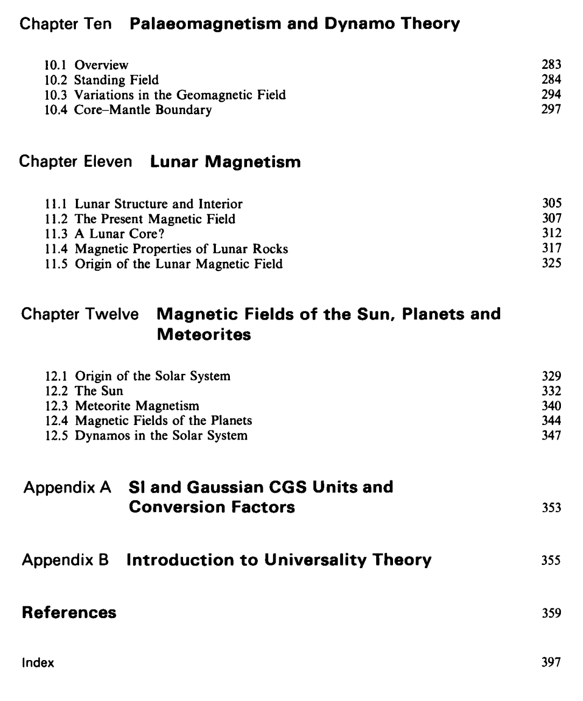
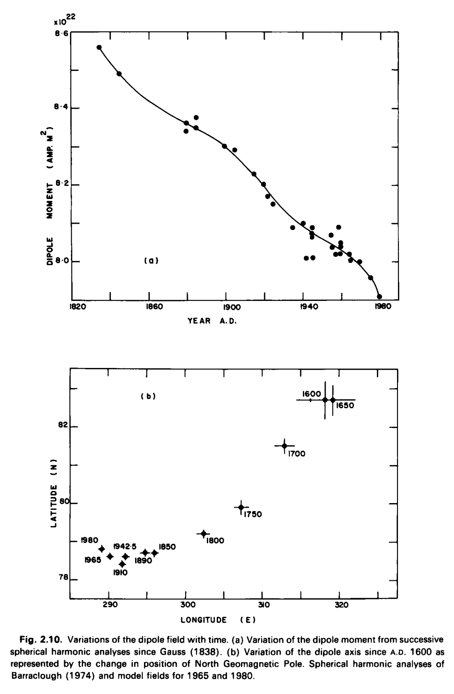

# McElhinny

## Book: Paleomagnetism (hard copy here)

This is the more recent version of his book, I assume most of the content is the same.

He just quotes someone else's work when citing the decrease of the geomagnetic dipole moment.

## The Earth's magnetic field: Its history, origin and planetary perspective (hard copy here)

"Thus after a historical introduction in Chapter 1, the more traditional aspects of geomagnetism relating to the present field and historical observations are presented in Chapter 2. The various methods and techniques and theoretical background of palaeomagnetism are given in Chapter 3. Chapters 4, 5 and 6 present the results of palaeomagnetic and archaeomagnetic studies in three topics. Chapter 4 relates to studies of the geomagnetic field roughly back to about 50,000 years ago. Chapter 5 is about reversals of the geomagnetic field and Chapter 6 presents studies of the field for times older than 50,000 years and on the geological time scale of millions or hundreds of millions of years. Chapters 7, 8 and 9 provide insight into dynamo theory. Chapter 7 is essentially a non-mathematical attempt to explain the physical basis of dynamo theories to palaeomagnetists. This is followed in Chapter 8 by a more advanced theoretical treatment for those with greater mathematical skills. Chapter 9 explains theoretical aspects of secular variation and the origin of reversals of the geomagnetic field. Chapter 10 is our attempt to bring the two sides together, to relate theory to experiment and vice versa."

"The dipole field is also changing with time. The intensity of the dipole field has decreased at the rate of about 5 % since the time of Gauss' analysis in 1835 (Leaton and Malin, 1967; Vestine, 1967; McDonald and Gunst, 1968) (Fig. 2.lOa). Indeed, Leaton and Malin (1967) and McDonald and Gunst (1968) have speculated on the demise of the main dipole around A.D. 3700 to 4000 if the present trends continue. The dipole axis, however, as represented by the position of the North Geomagnetic Pole has hardly changed its position since the analysis of Gauss (Bullard et 01.,1950). Over the past 150 years there appears to have been a slow westward change of near 0.05° per year in azimuth angle, but no progressive motion in polar angle (Nagata, 1965; McDonald and Guest, 1968)." [Page 45]

Playing telephone game I see!

Page 48:

