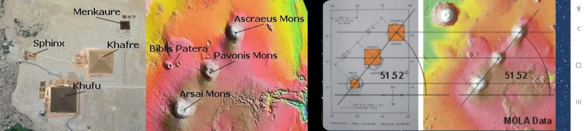

# Saturn Death Cult

Could the unexplainable megolithic structures built on earth been built when earth was in the theorised string of planets with Mars, Venus and Saturn the brown dwarf star. There were no days just constant light from Saturn and much lower gravity and existence of mega flora and fauna. Advanced civilisations may have been able to travel between Mars and Earth with the planets held in place by birkeland currents. During the devastating capture of this system by the sun were the pyramids built in an attempt to maintain the birkeland currents and prevent the system being rent apart? This clearly failed, the capture took place, life on Mars was destroyed and Earth went through the creation process described in Genesis and began the catastrophe cycle driven by the sun.

Coincidence Alert...    https://www.msn.com/en-gb/news/techandscience/extraordinary-giant-structures-discovered-beneath-the-surface-of-mars/ar-AA1qF2YV?ocid=winp2fptaskbarhoverent&cvid=f0a8ecd89b064c16a388a6f144bc9fb7&ei=11