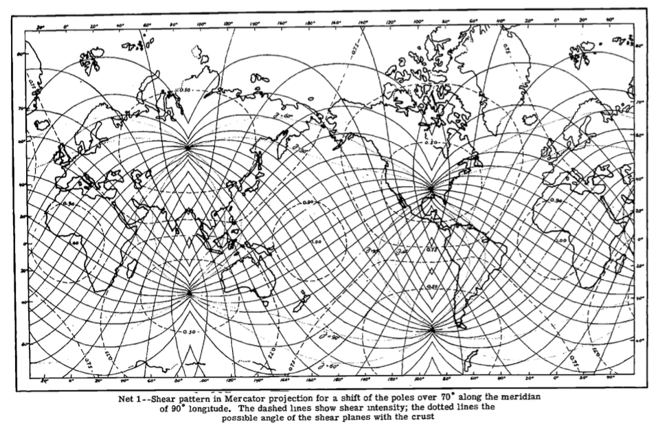
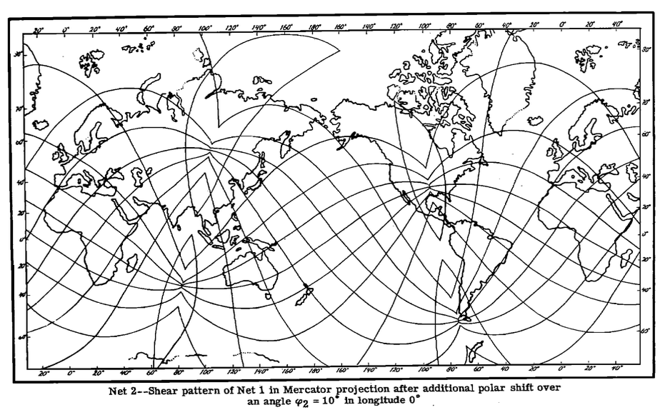

# Felix Andries Vening Meinesz

Felix Andries Vening Meinesz was a Dutch geophysicist and geodesist. He is known for his invention of a precise method for measuring gravity. Thanks to his invention, it became possible to measure gravity at sea, which led him to the discovery of gravity anomalies above the ocean floor.

## SHEAR PATTERNS OF THE EARTH'S CRUST

Hard copy here.

### Quotes

We may affirm that since the movement of the poles has led to the shearing of the crust, no con­ tinental shift of any appreciable amount can have occurred, because such a movement would have disturbed the Net. Moreover, the shearing of the crust can only have taken place in the manner described if the crust formed a rigid whole, and this excludes the idea of any continental shift of large dimensions.

In the last place we shall attack the hardest problem of all, the explanation of the correlation of the edges of continental shelves with our Not. This Introduces the following difficulty: It is well known that the seismic evidence is in favor of the granite layer of the crust being thicker in the continents than in the oceans; In part of the Pacific, and perhaps in the Arctic, this layer appears even to bo entirely absent. According to the gravity results obtained in coastal profiles, this transition in thickness, in general, is rather sudden, and it coincides, or nearly coincides, with the edge of tho shelf. On the other hand, it is clear that the shearing of the crust can not have affected UH constitution and so this can not in itself have brought about the difference of the thickness of
the granite layer. So we are bound to assume that these differences, at least for the correlated shelf edges, came Into being after the shearing had taken place. The problem Is how this can have taken place. In examining this problem we shall see that practically the only possible solution is given by tho supposition that the course of a great part, if not all of the continental edges, Is of a more recent date than tho granite blocks of the continents themselves and that thus their formation
can be posterior to the shearing catastrophe and can be correlated to its net of lines. This is Immediately clear for those shelf edges where the trend is determined by recent orogeny, as, for example, la tho caso for the west coast of North and South America and the east coast of ABia.

The main evidence in Chapter III favorable to the existence of a world-wide shearing net in the Earth's crust is tho correlation tho topography shows with our Not over a great part of the Earth's surface. In order to make this evidence valid, It is necessary to indicate how tho presence of shear planes In the crust may bring about topographic features—the problem investigated in this Chapter,

# GPT: Summary of "Shear Patterns of the Earth's Crust" by F. A. Vening Meinesz

## **Chapter I: Introduction and Summary**
This chapter introduces the concept of shear planes in the Earth’s crust and explores possible planetary causes:
1. **Decrease in Earth's Flattening:** Caused by tidal friction and slowing rotation.
2. **Shift of Earth's Rotation Axis:** Movement of the axis relative to the crust.

The evidence favors the second hypothesis, correlating the shear pattern with Earth’s topography, volcanic activity, and gravity fields. The hypothesis contradicts Wegener's theory of continental drift. The chapter sets out to investigate stress patterns, topographic evidence, and resultant geological features.

## **Chapter II: Stresses and Deformations of the Crust**
This chapter focuses on analyzing the stresses from polar shifts and changes in Earth's flattening:
- **External Forces:** Shifts in the Earth's axis due to external forces like the Sun and Moon are deemed unlikely.
- **Subcrustal Currents:** Movements in the crust relative to the interior may be driven by subcrustal currents.
- **Stress Calculations:** Assumes a uniform thickness of the crust. Stresses from a polar shift are estimated to exceed 2000 kg/cm².

The chapter concludes that deformation of the crust is more likely due to polar shifts than changes in flattening.

## **Chapter III: Evidence from Topography and Geophysics**
The chapter examines topographical and geophysical evidence supporting the shear pattern hypothesis:
- **Topography:** Oceanic features align well with the predicted shear net, as these areas are less affected by erosion.
- **Gravity Anomalies:** Gravimetric surveys indicate correlations with the shear net, providing additional evidence.
- **Seismic Data:** Earthquake epicenters show a strong alignment with the shear pattern, supporting the hypothesis.

The findings suggest a strong connection between the proposed shear net and major geological features, reinforcing the hypothesis of a polar shift.

## **Chapter IV: Tho Effect on the Topography of Fault Planes in the Crust**
This chapter explores the geological impact of shear patterns on Earth's surface features:
- **Formation of Fault Planes:** Shear zones may have contributed to volcanic activity and shaped continental coastlines.
- **Influence on Tectonics:** Suggests that subcrustal currents might have driven early polar shifts, creating the existing fault systems.
- **Rejection of Continental Drift:** The hypothesis implies that the crust behaved as a rigid shell undergoing shear deformation rather than continental drift.

The chapter concludes that tectonic processes and topographic features are better explained by shear deformation than by the theory of large-scale continental shifts.

## **General Conclusions**
- **Polar Shift as Primary Cause:** The Earth's crust likely experienced significant shearing due to polar shifts rather than changes in flattening.
- **Support for Shear Hypothesis:** The alignment of shear patterns with topographical and geological features provides strong evidence for the hypothesis.
- **Rejection of Wegener’s Drift Theory:** The results suggest that the Earth’s crust acted as a rigid whole influenced by shear deformation, not by continental drift.

The document presents a comprehensive investigation into Earth's shear patterns and their role in shaping geological features, challenging prevailing theories of continental movement.
