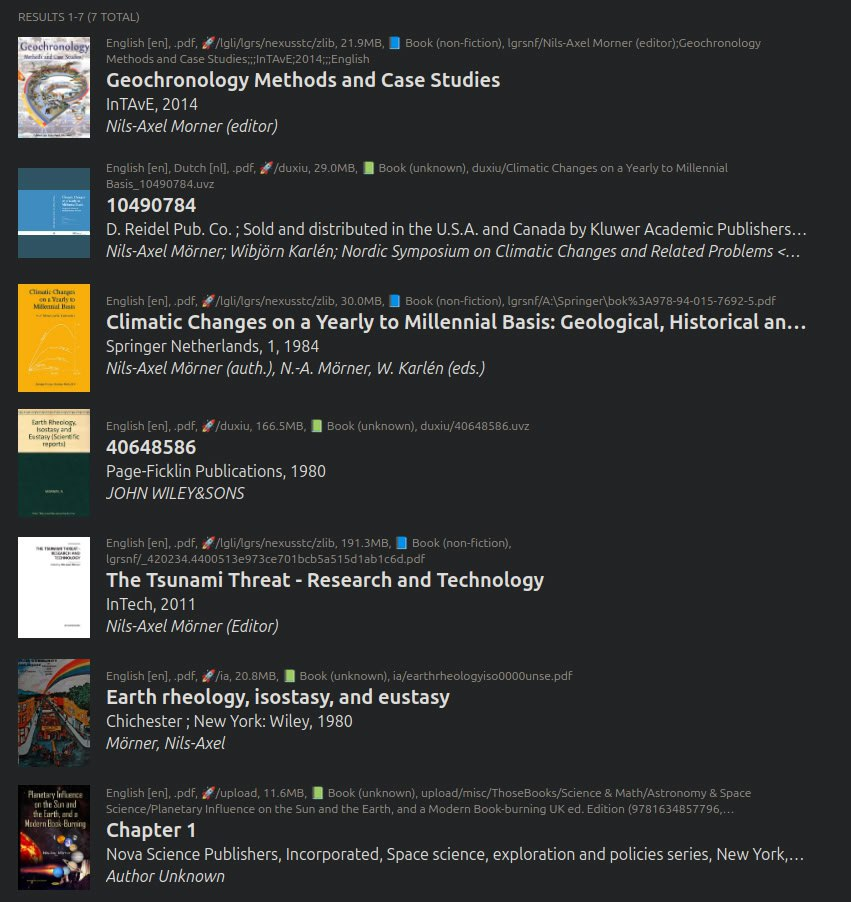
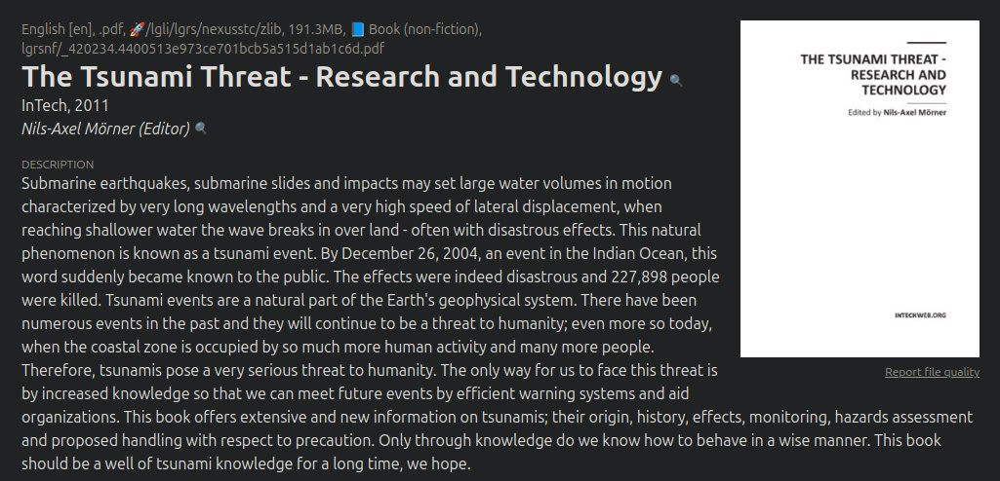
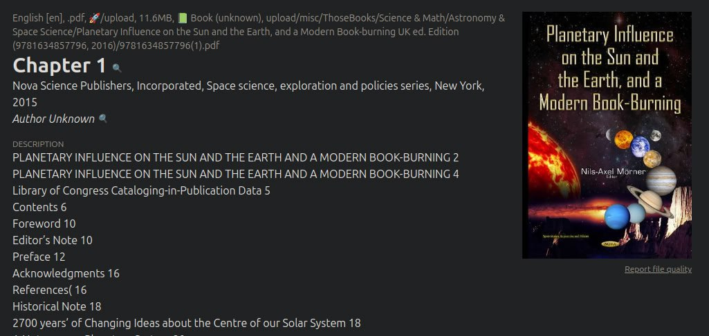
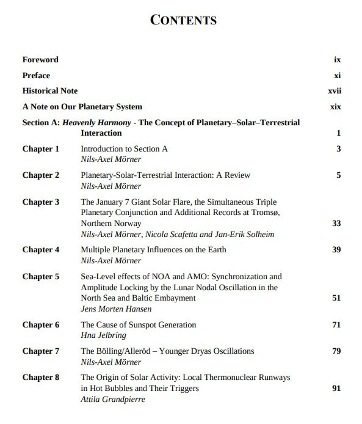
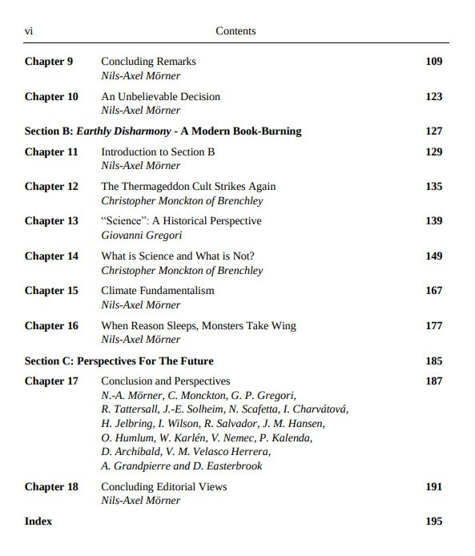
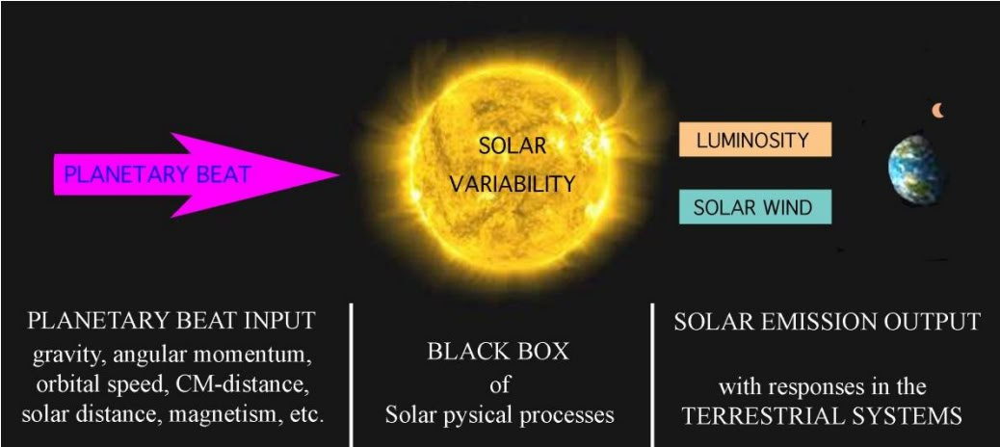
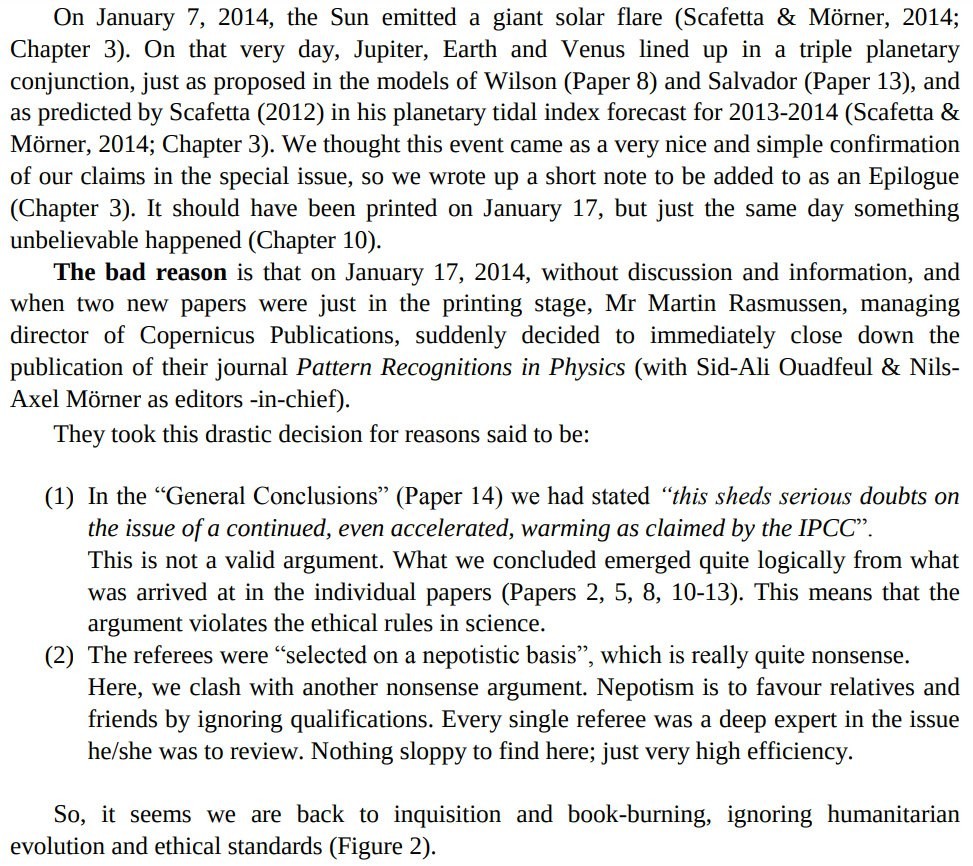

# Nils-Axel Morner [1]

Nils-Axel Morner is a giant among geochronologists. No less than seven books and over a hundred peer-reviewed papers.

https://annas-archive.org/search?index=journals&page=1&q=nils-axel+morner&sort=

Anyone who spends time studying the cycles and effects of the Sun is going to know that AGW is bunk. Morner clearly does.

"In our analyses , I think we have documented that there are strong agreements and correlations between the input from planetary beat and the output of solar emission and its effects on various terrestrial systems. The establishment of a close correlation between planetary beat, solar variability and terrestrial responses was the goal of our efforts, and we trust we have achieved that goal – by that elevating on old hypothesis to a firm theory, maybe even a new paradigm." - Planetary Influence on the Sun and the Earth, and a Modern book Burning, Nils-Axel Mörner (2015)

I didn't expect the chap who dug out those varved clay proxies in the 70's was going to be a planetary harmonics proponent as well.

It appears that Morner and Scafetta were longtime colleagues/friends. Both appear to be major contributors to this book. Morner died in 2020.

## Citations

1. [Craig Stone](https://nobulart.com)