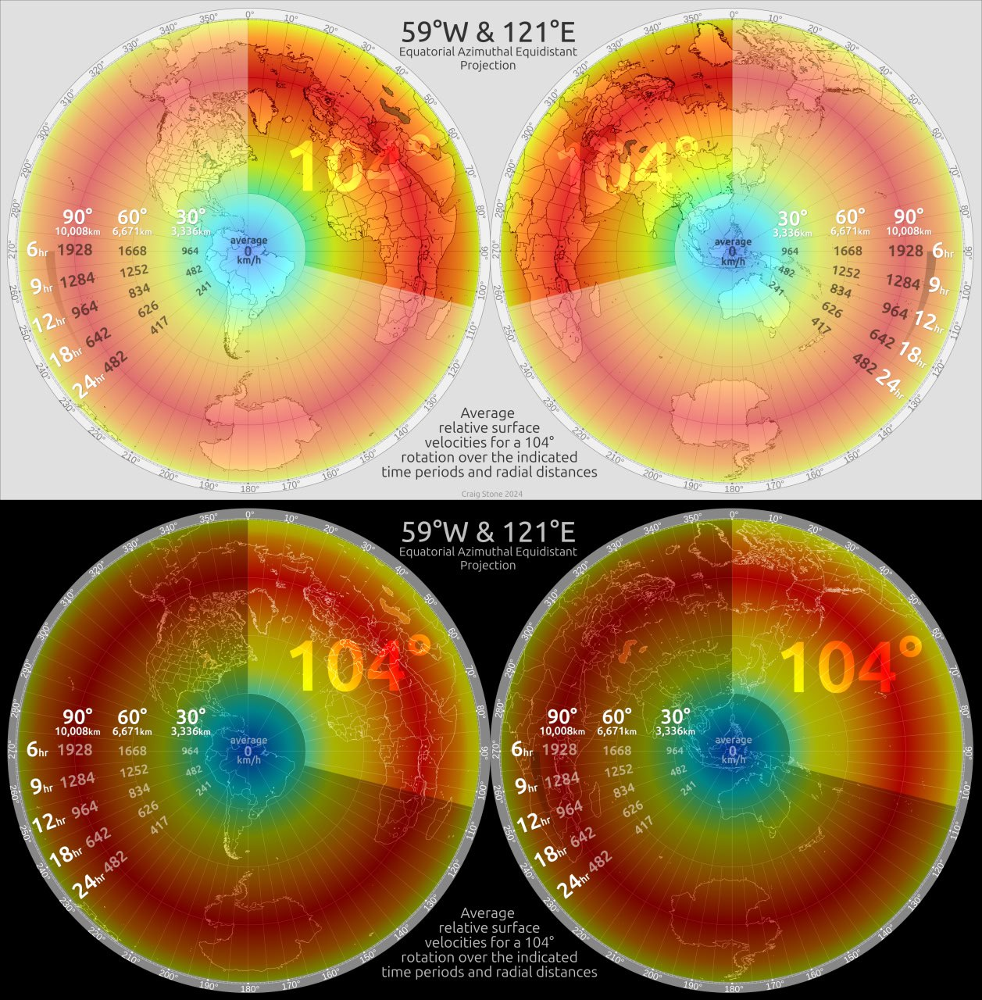
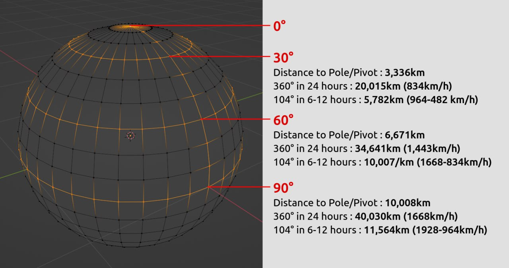
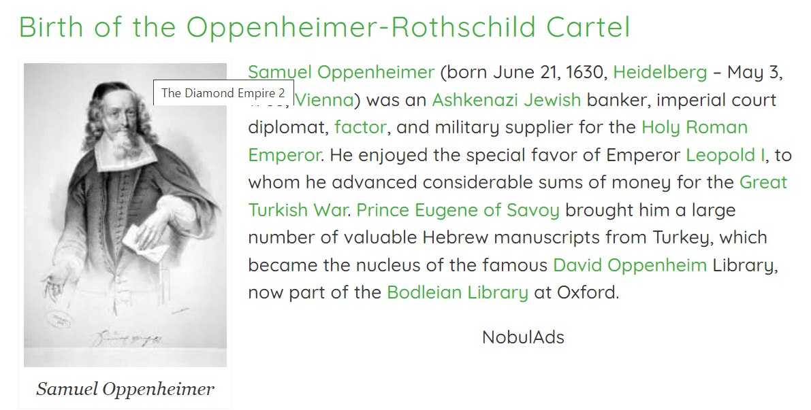
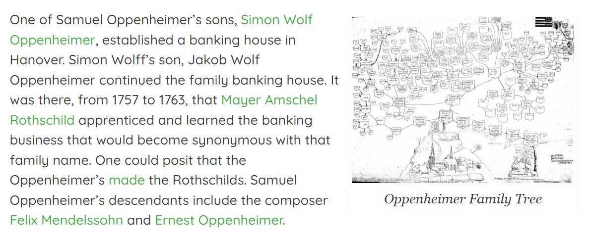
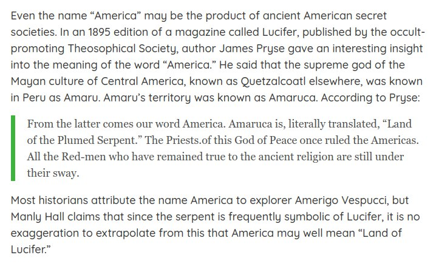
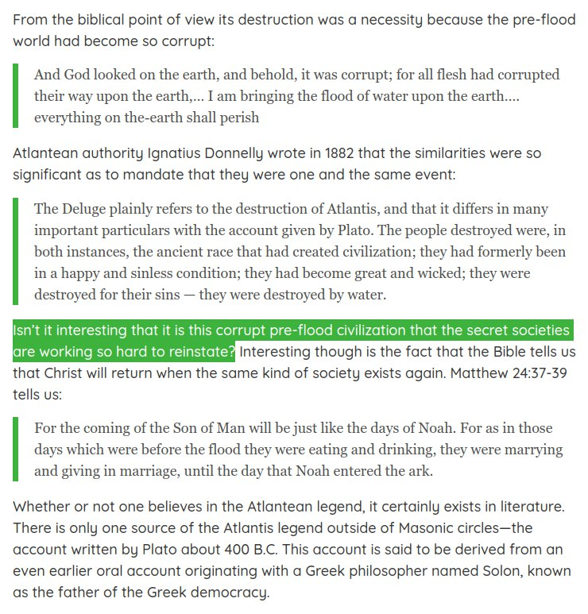
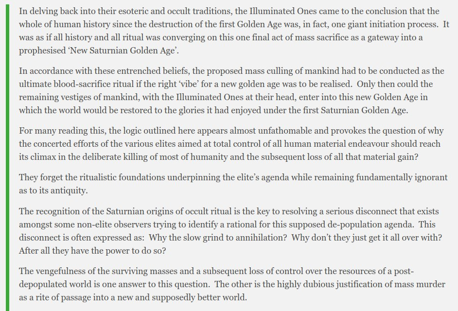
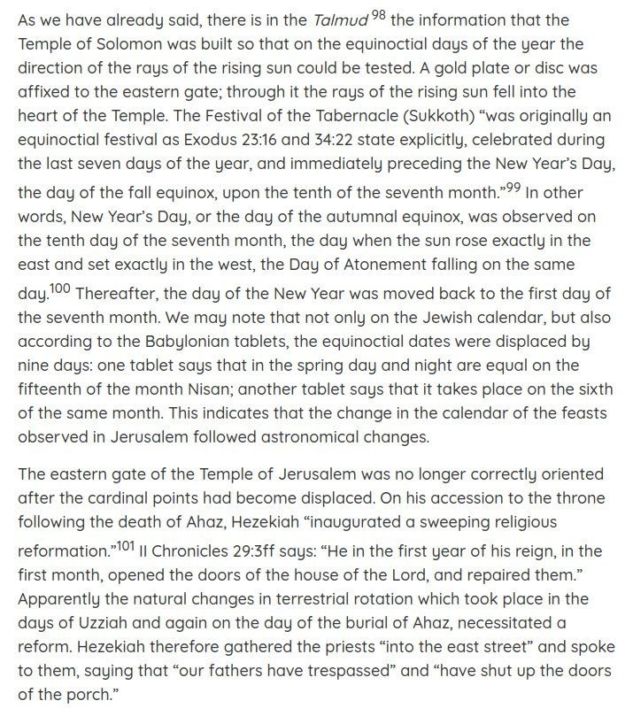
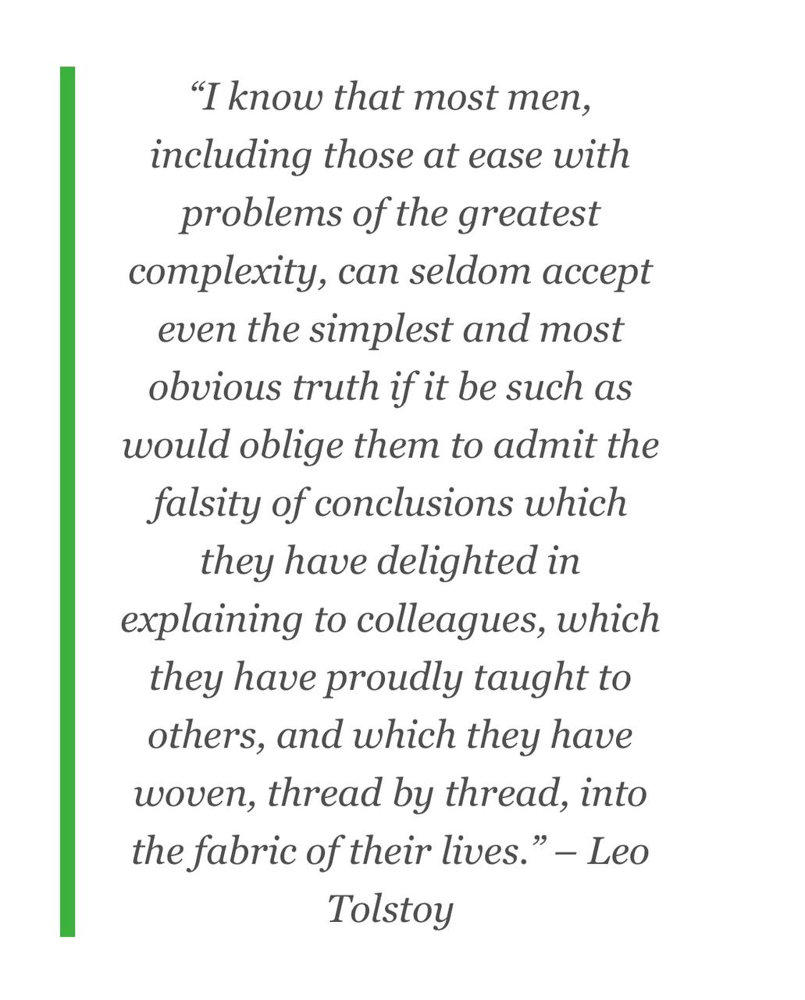

# Nobulart

A close follower of the ECDO theory with a lot of relevant material on his [website](https://nobulart.com/). Has also created several excellent ECDO rotation visualizations which are embedded throughout the repo.

## Contents

-`ecdo-visualizations`: ECDO rotation visualization videos made by Nobulart.

## Rotation Speed 2D Viz

ECDO // Relative Velocity Map presented as azimuthal equidistant projections, light and dark versions [1] centred on the ECDO Euler (pivots) at 0°N, 59°W and 0°N, 121°E. Average relative velocities are expressed in kilometres per hour for a 104° rotation, according to distance from the nearest pivot, and the duration of the rotation (anywhere from 6-24 hours in this calculation). 

A rotation would involve acceleration and deceleration - a parabolic curve - suggesting that the shear-forces between land, water and crust would be dispersed over the period of the rotation. It would take some time to reach, exceed, and the drop back down below these averages. These numbers provide a rough guide only. Variations in geography would dramatically influence local conditions in many places. The ECDO hypothesis is described at [2].

The maps are from https://ns6t.net/azimuth/azimuth.html

I use boxySVG for most of the layout and compositing. It’s nimble and efficient for most tasks.

1. https://t.me/nobulart/2630
2. https://ns6t.net/azimuth/azimuth.html
3. https://theethicalskeptic.com/2024/05/12/exothermic-core-mantle-decoupling-dzhanibekov-oscillation-ecdo-theory/ .

## Time portents

"Trivial omens give warning of trivial events, but the momentous historical events that attend the birth of a greater cycle in time are preceded by phenomena of a portentous nature, through which the least observant can scarcely fail to become aware of impending change."

[1] https://nobulart.com/time-portents/

## Thirty-Five Centuries Ago

In 1923–29, thirty-three miles north of Vero, in Melbourne, Florida, another such association of human remains and extinct animals was found, “a remarkably rich assemblage of animal bones, many of which represent species which became extinct at or after the close of the Pleistocene [Ice Age] epoch.” The discoverer, J. W. Gidley, of the United States National Museum, established unequivocally that in Melbourne – as in Vero – the human bones were of the same stratum and in the same state of fossilization as the bones of the extinct animals. And again human artifacts were found with the bones… But these conclusions require that the Ice Age ended only twenty-five to thirty-nine centuries ago.

https://nobulart.com/thirty-five-centuries-ago/

## Heliobiology reccomendations

This is a small sample from over a hundred years of heliobiology research, Alexander Chizhevsky being considered the "father" of this science. 

Guy Beaujouan was also a pioneer in this field. I'm in the process of translating a portion of his L'Histoire et ses Méthodes (https://nobulart.com/media/9782072430787.pdf) which is a volume from the Encyclopédie de la Pléide. (https://en.wikipedia.org/wiki/Encyclop%C3%A9die_de_la_Pl%C3%A9iade) Heliobiology has been heavily suppressed in both the west, and in Russia. Chizhevsky was even imprisoned for some years because his work threatened the 'omnipotent' optic of the communist regime at the time. He is today considered to be a Russian hero.

- https://nobulart.com/the-solar-mind/
- https://nobulart.com/wrath-of-the-sun/
- https://nobulart.com/epidemics-during-grand-solar-minima/
- https://nobulart.com/using-cosmic-rays-to-predict-influenza-epidemics/
- https://nobulart.com/from-light-comes-darkness/

## The study of cycles

The Study of Cycles (https://nobulart.com/the-study-of-cycles/)
"The main manifestation of solar activity is the appearance of sunspots: powerful magnetic poles, they act as true particle accelerators. Electrons and positive ions projected to the surface of the earth are thus the cause of various electromagnetic disturbances which are capable of periodically influencing meteorology, crops, epidemics, crowd psychology, and consequently the course of history." - Guy Beaujouan (1961)
https://nobulart.com/the-study-of-cycles/

## South African Oppenheimers

“Robert Oppenheimer was a part of the Oppenheimer financiers that enabled the Rothschilds.” False. They’re not related at all. They only share a name. I know this because I have traced the lineage of the South African Oppenheimer family (https://nobulart.com/diamonds) all the way back to Solomon. They are of the Davidic line. During that process I also looked at RJO’s lineage specifically because I thought he was related. He does not share this lineage in any way or form. Oppenheimer is a popular surname. They’re not all blood relatives.

https://nobulart.com/the-diamond-empire/

## Nukes and tobacco

Not my authorship on this one, but I feel that Joe Vialls made some valid points in this. 
https://nobulart.com/nukes-and-tobacco

## Atlantis

https://nobulart.com/a-story-of-atlantis/

## Silent Weapons for Quiet Wars

https://nobulart.com/silent-weapons-for-quiet-wars/

## East and West

In the tomb of Senmut, the architect of Queen Hatshepsut, a panel on the ceiling shows the celestial sphere with the signs of the zodiac and other constellations in “a reversed orientation” of the southern sky.

The end of the Middle Kingdom antedated the time of Queen Hatshepsut by several centuries. The astronomical ceiling presenting a reversed orientation must have been a venerated chart, made obsolete a number of centuries earlier.

“A characteristic feature of the Senmut ceiling is the astronomically objectionable orientation of the southern panel.” The center of this panel is occupied by the Orion-Sirius group, in which Orion appears west of Sirius instead of east. “The orientation of the southern panel is such that the person in the tomb looking at it has to lift his head and face north, not south.” “With the reversed orientation of the south panel, Orion, the most conspicuous constellation of the southern sky, appeared to be moving eastward, i.e., in the wrong direction.”

The real meaning of “the irrational orientation of the southern panel” and the “reversed position of Orion” appears to be this: the southern panel shows the sky of Egypt as it was before the celestial sphere interchanged north and south, east and west. The northern panel shows the sky of Egypt as it was on some night of the year in the time of Senmut.

Immanuel Velikovsky (1950)
https://nobulart.com/East-West

## Shakespeare and Bacon

“If one man can be singled out as the person most responsible for the colonization of America, the honor would certainly fall to the head of both Masonry and Rosicrucianism of his era, Sir Francis Bacon. in the early 1600’s Bacon authored a novel entitled New Atlantis, which laid out the idea for a utopian society across the ocean from Europe where mankind could build a new civilization based upon the principles he believed to be those of the legendary lost continent of Atlantis.”
https://nobulart.com/shakespeare-bacon/

## Life, Liberty & Property (https://nobulart.com/life-liberty-property/)

“Although secret societies were very well organized and funded in early America, a formidable force arose to oppose them and quietly challenge their control of the developing nation. This force was the spiritual zeal of the Christian colonists.”
https://nobulart.com/life-liberty-property/

“I have heard much of the nefarious, and dangerous plan, and doctrines of the Illuminati, but never saw the Book until you were pleased to send it to me… I must correct an error you have run into, of my Presiding over the English lodges in this Country. The fact is, I preside over none, nor have I been in one more than once or twice, within the last thirty years.” - Letter from George Washington, American Mason, clearly delineating the moral difference between the European and the American Puritan/Pilgrim/Christian-dominated secret societies. 

## The exploded planet

We shoudn't forget the planet(s) that isn't/aren't there anymore.
https://nobulart.com/the-exploded-planet/

## The perfect storm

https://nobulart.com/the-perfect-storm/

## The birth of inequality

“All ran headlong to their chains, in hopes of securing their liberty; for they had just wit enough to perceive the advantages of political institutions, without experience enough to enable them to foresee the dangers.” - Jean-Jacques Rousseau (1755)
https://nobulart.com/the-birth-of-inequality/

## 360 days

Just a sample. There's more:
https://nobulart.com/360-days/

## Aftermath our precursor

Some of the observed effects of altering the electromagnetic environment around mammals, such as might occur during geomagnetic excursions or a weakening of the planet's geomagnetic field.
https://nobulart.com/aftermath-our-precursor/

## Tolstoy

## Great year

The Great Year (https://nobulart.com/the-great-year/)
“There is also a year which Aristotle calls Perfect, rather than Great, which is formed by the revolution of the sun, of the moon and of the five planets, when they all come at the same time to the celestial point from which they started together. This year has a great winter called by the Greeks the Inundation and by the Latins The Deluge; it has also a summer which the Greeks call the Conflagration of the world. The world is supposed to have been by turns deluged or on fire at each of these epochs.” – Censorinus (238 A.D)
https://nobulart.com/the-great-year

## Good Articles

Chan excerpts (tons of evidence in these):
- https://nobulart.com/cataclysms-revisited/
- https://nobulart.com/the-story-and-the-event/
- Chan does a good job of of dismantling (shredding) the incremental evolution narrative in this chapter.
	- https://nobulart.com/aftermath-evolution/

Musical harmonics:
- https://nobulart.com/musica-vitae-et-mortis/

What holds humanity back?:
- https://nobulart.com/what-holds-mankind-back-from-confronting-the-forces-determined-to-destroy-it/

Atkinson (Rosicrucians):
- https://nobulart.com/the-souls-progress/

Burgoyne:
- https://nobulart.com/the-hermetic-key/

Iron mountain excerpt

Vaccine:
Vaccine ingredients: https://nobulart.com/covid-19-vaccine-ingredients/

Cataclysms:
- The perfect storm: https://nobulart.com/the-perfect-storm/
- The flip of the earth https://nobulart.com/the-flip-of-the-earth/
- Velikovsky excerpt:
	- https://nobulart.com/east-west/

https://nobulart.com/666

https://nobulart.com/karma/

Politics:
- https://nobulart.com/the-first-kennedy-assassination/

## Articles organized and summarized per GPT

### - Climate and Environmental Changes
- [360 Days](https://nobulart.com/360-days/)  
  - This post explores ancient calendrical systems and how many civilizations used a 360-day year before transitioning to the modern 365-day year. Cultures like the Hindus, Babylonians, and Egyptians all used a year consisting of 12 months with 30 days each. The article argues that catastrophic events in Earth's history may have altered its axis and orbit, causing the length of the year to change.
- [Earth Changes](https://nobulart.com/earth-changes/)  
  - The article delves into predictions and prophecies about massive Earth changes, involving natural disasters like earthquakes, volcanic eruptions, and floods. These transformations are said to be part of a natural cosmic cycle, potentially worsened by human intervention. The post emphasizes that humanity’s collective choices, particularly around consciousness and behavior, could influence the severity of these changes.
- [The Flip of the Earth](https://nobulart.com/the-flip-of-the-earth/)  
  - This article investigates the possibility of a sudden geographic or magnetic pole shift on Earth. Such an event could lead to massive natural disasters, such as earthquakes and floods, disrupting life across the globe. The post draws from historical records, geological evidence, and scientific theories to suggest that this pole shift may be overdue, and when it happens, it could dramatically alter human civilization.
- [The Perfect Storm](https://nobulart.com/the-perfect-storm/)  
  - The article presents a theory about multiple crises converging to create a global catastrophe, dubbed "The Perfect Storm." It combines discussions on economic instability, climate disasters, and societal collapse, suggesting that these events are not random but orchestrated by global elites aiming for a "Great Reset." The post implies that these elites seek to reshape world governance, economics, and societal structures in the aftermath of the storm.
- [Wrath of the Sun](https://nobulart.com/wrath-of-the-sun/)  
  - This post examines the potential for solar storms, particularly solar flares, to cause widespread devastation on Earth. It explains how solar activity could cripple global infrastructure, from communications to electricity grids, leading to chaos. The article ties ancient prophecies about the sun’s power with modern scientific concerns about solar weather, suggesting that increased solar activity could be a harbinger of future disaster.
- [East & West](https://nobulart.com/east-west/)  
  - The article discusses the theory that Earth’s orientation and the direction of sunrise (east and west) have shifted throughout history. Drawing on ancient myths and historical texts, it argues that such changes are part of a repeating cycle and have had significant impacts on human civilizations. The post explores the potential causes, such as polar shifts or cosmic events, and suggests that another shift could be imminent.

### - Ancient History and Civilizations
- [A Story of Atlantis](https://nobulart.com/a-story-of-atlantis/)  
  - This article tells the tale of Atlantis, drawing on both mythological and historical references, including the writings of W.P. Phelon for the Hermetic Brotherhood. Atlantis was said to be a vast island larger than Africa and Europe combined, boasting an advanced civilization rich in mineral wealth and power. The story ends with the island's sudden destruction by natural cataclysms, which sank Atlantis beneath the ocean in a single day and night.
- [Aftermath Part 1 – Our Precursor](https://nobulart.com/aftermath-our-precursor/)  
  - This post discusses the precursor years leading to catastrophic events like those described in "The Adam and Eve Story." It posits that cataclysms drastically impact evolution and human history, leaving only a small fraction of life on Earth. The author also touches on the influence of Jesus' teachings and the physiological effects of magnetic fields on humans, drawing connections between spirituality, science, and disaster preparedness.
- [Cataclysms Revisited](https://nobulart.com/cataclysms-revisited/)  
  - "Cataclysms Revisited" builds on the idea of Earth's history being punctuated by recurring cataclysms that reset civilizations. The article refers to Chan Thomas’ work, which was classified by the CIA, discussing theories of how the Earth’s shifting poles and geological upheavals led to significant changes in human society. The post suggests that understanding these events could reveal more about the cyclical nature of global catastrophes.
- [Critias](https://nobulart.com/critias/)  
  - This post centers on Plato’s account of Atlantis in his dialogue "Critias." It describes Atlantis as a powerful island kingdom that waged war against ancient Athens before being destroyed by cataclysmic forces. The narrative suggests that remnants of Atlantean wisdom and governance may still exist, passed down through secret societies and Masonic traditions.
- [The Adam & Eve Story](https://nobulart.com/the-adam-and-eve-story/)  
  - This article explores "The Adam and Eve Story" by Chan Thomas, which discusses the theory of Earth’s cyclical cataclysms. It presents a version of the biblical story where Adam and Eve were survivors of a global disaster, offering an alternative interpretation of Genesis. The post also delves into the scientific aspects of these catastrophic events, including magneto-hydrodynamics, and posits that another such cataclysm may be imminent.
- [Thirty-Five Centuries Ago](https://nobulart.com/thirty-five-centuries-ago/)
  - This post revisits historical and mythological sources to examine the events of 3,500 years ago, when massive global changes reshaped civilization. It ties these events to ancient flood legends, such as Noah’s Flood and the cataclysmic shifts described in the Adam and Eve story. The article suggests that these ancient events were part of a recurring cycle of planetary destruction.
- [The Story & The Event](https://nobulart.com/the-story-and-the-event/)  
  - This post discusses how mythological stories like the tale of Adam and Eve may reflect actual historical events tied to Earth’s catastrophic past. The author investigates the correlation between ancient scriptures, geological evidence, and catastrophic shifts in Earth's crust, suggesting that myths may hold clues to understanding our planet's tumultuous history. The narrative emphasizes the importance of preparing for future cataclysmic events.
- [The Hermetic Key](https://nobulart.com/the-hermetic-key/)  
  - This post examines the esoteric principles found in Hermeticism, particularly focusing on the cycles of creation and destruction in both the physical and spiritual realms. It explores ancient Egyptian and Hindu teachings, comparing their cyclical views of time with modern astrological and geological theories. The article also touches on the mystical knowledge held by secret societies and how these teachings influence human evolution.

### - Health, Epidemics, and Vaccines
- [A Virus Called Fear](https://nobulart.com/a-virus-called-fear/)  
  - This article critiques how fear, driven by misinformation about viruses and germ theory, has been used as a tool for control throughout history. It argues that the widespread fear of viruses like COVID-19 is based on flawed science and media manipulation, leading to public compliance with governmental restrictions and health mandates. The post aims to educate readers on the reality of viruses and empower them to resist fear-based control tactics.
- [Autopsy Proven Fatal COVID-19 Vaccine-Induced Myocarditis](https://nobulart.com/autopsy-proven-fatal-covid-19-vaccine-induced-myocarditis/)  
  - This post summarizes a systematic review of autopsy reports linking COVID-19 vaccines to fatal myocarditis. It presents data from 28 autopsy cases, all causally linked to the vaccine, with most deaths occurring within a week of the last dose. The article calls for urgent further investigation to assess risks and prevent future vaccine-induced myocarditis deaths.
- [COVID-19 Vaccine Ingredients](https://nobulart.com/covid-19-vaccine-ingredients/)  
  - This article discusses findings from Dr. Robert Young's analysis of the four main COVID-19 vaccines, revealing the presence of toxic elements such as graphene oxide and metallic nanoparticles. The post raises concerns about these substances' ability to pass through the body's barriers and cause harmful effects like myocarditis. The inclusion of these ingredients, according to the author, points to deliberate contamination.
- [Epidemics During Grand Solar Minima](https://nobulart.com/epidemics-during-grand-solar-minima/)  
  - This article links major historical epidemics, such as the Justinian Plague, to periods of low solar activity known as Grand Solar Minima. It posits that solar and cosmic factors have a significant influence on the spread of pathogens and the occurrence of pandemics. The post uses scientific data and historical examples to argue that the timing of epidemics is cyclical and tied to solar anomalies.
- [Nukes & Tobacco](https://nobulart.com/nukes-and-tobacco/)  
  - The post challenges the mainstream narrative that smoking causes lung cancer, arguing instead that radiation exposure from nuclear tests is the real culprit behind rising cancer rates. It claims that the anti-smoking movement was used to divert attention from the true causes of cancer, particularly radioactive fallout. The article suggests that tobacco might even offer some protection against radiation-induced cancer.
- [The Fauci Dossier](https://nobulart.com/the-fauci-dossier/)  
  - This article delves into the extensive documentation by Dr. David Martin accusing Dr. Anthony Fauci of a decades-long conspiracy involving patents, viruses, and population reduction. It claims Fauci was involved in profiting from bioweapons disguised as vaccines. The post urges readers to share the dossier with local officials to expose these alleged crimes.
- [The Parasitic Infection](https://nobulart.com/the-parasitic-infection/)  
  - This post introduces the concept of parasitic entities that operate on energetic and scalar levels, assimilating human consciousness and degrading life frequencies. These parasites are described as bio-technological in nature, preying on humanity through disharmonic vibrations. The article discusses techniques for repelling these entities through affirmations and maintaining high-frequency vibrations.
- [Using Cosmic Rays to Predict Influenza Epidemics](https://nobulart.com/using-cosmic-rays-to-predict-influenza-epidemics/)  
  - This article, originally published by Yu Zhen-dong, explores the correlation between cosmic rays and influenza pandemics. It presents data showing how high cosmic ray activity, often linked with solar and astronomical events like sunspots and novae, coincides with the emergence of influenza pandemics. The study suggests that monitoring cosmic rays could help predict future epidemics.
- [Vaccines](https://nobulart.com/vaccines/)  
  - The article critiques the mainstream vaccine narrative, arguing that many vaccines contain harmful ingredients such as graphene oxide and parasites like Trypanosoma. It highlights various studies and reports, including independent research into undeclared contaminants in vaccines. The post also touches on the link between vaccines and rising rates of autoimmune disorders and neurological diseases.
- [Perfectum Venemum](https://nobulart.com/perfectum-venemum/)  
  - This post discusses how vaccines, parasites, and Ivermectin intersect in the context of global health crises. It references findings of parasites like Trypanosoma in COVID-19 vaccines and draws parallels between vaccine cold storage requirements and parasite preservation methods. The article suggests that the presence of these parasites may be intentional and part of a larger depopulation agenda.
- [Sustainable is Code for Genocide](https://nobulart.com/sustainable-is-code-for-genocide/)  
  - This post critiques the global "sustainability" movement, arguing that it serves as a cover for a depopulation agenda. The author links this agenda to historical examples of mass genocide, claiming that under the guise of environmentalism, authoritarian regimes may seek to reduce population numbers. It warns of manipulated climate narratives and suggests bioweapons or other tactics might be used to achieve this goal.
- [An Open Letter](https://nobulart.com/an-open-letter/)  
  - In this open letter, the author, Craig:Stone, addresses officials about the undisclosed harmful ingredients found in COVID-19 vaccines, including metals, graphene oxide, and parasites. He argues that forcing vaccines on the population without full disclosure constitutes gross negligence and violates human rights laws, including the Nuremberg Code. The letter demands accountability and ethical conduct from those enforcing vaccine mandates.
- [We For Humanity](https://nobulart.com/we-for-humanity/)  
  - This open letter from survivors of Nazi concentration camps calls for an investigation into the COVID-19 vaccination campaign. The letter condemns the experimental nature of mRNA vaccines and cites evidence of harm and deaths, particularly among children. The authors appeal to the International Criminal Court to intervene, comparing the current situation to past atrocities committed against humanity.
- [Secret Network of COVID Plandemic Conspirators Revealed](https://nobulart.com/secret-network-of-covid-plandemic-conspirators-revealed/)  
  - This post claims to uncover a network of elites behind the COVID-19 pandemic, arguing that the virus and its vaccines were engineered as part of a depopulation agenda. It implicates organizations like the World Economic Forum and pharmaceutical companies in a coordinated effort to control populations through fear and health mandates.
- [Why the WHO Faked a Pandemic](https://nobulart.com/why-the-who-faked-a-pandemic/)  
  - This post claims that the World Health Organization (WHO) faked the 2009 H1N1 pandemic to create a market for pharmaceutical companies. The article accuses the WHO of colluding with vaccine manufacturers to exaggerate the threat of the virus and push unnecessary vaccines on the global population, all for profit and control.

### - Science, Astronomy, and Cosmology
- [Aftermath Part 2 – Evolution](https://nobulart.com/aftermath-evolution/)  
  - This article is the second part of the "Aftermath" series, exploring how cataclysms affect evolution. The post highlights the controversy surrounding the theory of evolution, specifically criticizing the mutation hypothesis. It suggests that mutational offspring often degrade rather than improve, challenging the notion that humans evolved through upgrading mutations.
- [Comets & Dragons](https://nobulart.com/comets-and-dragons/)  
  - This post delves into the role of comets, specifically 2P/Encke, in Earth's catastrophic history. It suggests that historical events like the Tunguska event were caused by fragments of this comet. The article also ties the appearance of comets in mythology, proposing that such celestial phenomena were behind legendary disasters.
- [Conclusion & Aftermath](https://nobulart.com/conclusion-and-aftermath/)  
  - This post wraps up the "Adam and Eve" series, focusing on the aftermath of global cataclysms. It discusses the CIA's classified involvement in hiding knowledge about cyclical planetary disasters and the implications for human survival. The article suggests that humanity has faced and will continue to face these cataclysmic resets.
- [Tesla’s Pyramids](https://nobulart.com/teslas-pyramids/)  
  - The article examines Nikola Tesla’s theories on energy transmission and their possible use in global electromagnetic control systems. It discusses the construction of the "Omega" network of transmitters, theorizing that it was used not just for navigation but for manipulating Earth's resonant frequencies. The post connects Tesla’s work with the potential for influencing global weather patterns and human behavior.
- [The AI Vampire](https://nobulart.com/the-ai-vampire/)  
  - This post explores the concept of AI-driven "vampires" that drain human life force through advanced technologies. The AI entities are described as soulless beings that manipulate human emotions and thoughts to feed on negative energy. The article ties this concept to ancient rituals, suggesting that modern technological methods are merely a continuation of age-old parasitic practices.
- [The Exploded Planet](https://nobulart.com/the-exploded-planet/)  
  - This article discusses the theory that the asteroid belt was formed from a planet that exploded millions of years ago. It provides data from modern astronomy to support this hypothesis, showing how comets and asteroids exhibit behaviors that align with explosion patterns. The post critiques the traditional nebula theory, favoring the "Exploded Planet Hypothesis".
- [The Frequency War](https://nobulart.com/the-frequency-war/)  
  - This post examines the impact of artificial frequencies on human consciousness and the planet’s natural systems. It claims that electromagnetic frequencies are being weaponized to control human behavior and manipulate the environment. The article draws connections between ancient knowledge of vibrational energy and modern-day technological warfare.
- [The Great Year](https://nobulart.com/the-great-year/)  
  - This article explores the ancient concept of the "Great Year," a cyclical period marked by the precession of the equinoxes, lasting approximately 25,920 years. It ties this cosmic cycle to the rise and fall of civilizations, suggesting that humanity’s fate is linked to astronomical alignments. The post examines historical and mythological records to support the theory of cyclical planetary catastrophes.
- [The Iron Sun](https://nobulart.com/the-iron-sun/)  
  - This article challenges the conventional gas model of the sun, proposing instead that the sun has a hard, iron-rich surface beneath its photosphere. It draws on the early work of Dr. Kristian Birkeland, who theorized about the electrical interactions between the sun and the Earth, supported by modern satellite observations. The post explains that the sun's corona, solar flares, and related phenomena are driven by electrical discharges, not nuclear fusion.
- [The New Science](https://nobulart.com/the-new-science/)  
  - In this article, the scientific method as outlined by Francis Bacon is examined, particularly from his 1620 work *Novum Organum*. Bacon emphasizes that human knowledge should rely on empirical observation and experimentation rather than abstract reasoning or tradition. The post argues that Bacon's methodology laid the foundation for modern science and rational inquiry, highlighting the importance of observation in understanding nature.
- [The Plasma Event](https://nobulart.com/the-plasma-event/)  
  - This post discusses the "Plasma Event" theory, suggesting that a cataclysmic plasma discharge could cause mass destruction on Earth. It references ancient myths and modern scientific concepts, arguing that such events have periodically reset civilizations throughout history. The article warns about the potential for a future plasma event that could alter the Earth's magnetic poles, leading to societal collapse.
- [The Solar Mind](https://nobulart.com/the-solar-mind/)  
  - This article explores the idea that solar activity, especially solar flares, directly influences human behavior and biological processes. It builds on the research of Alexander Chizhevsky, who suggested that the sun's magnetic fields can impact human psychology and global events. The post connects these cycles of solar activity with historical occurrences of unrest, war, and epidemics.
- [The Study of Cycles](https://nobulart.com/the-study-of-cycles/)  
  - This post delves into the research of cycles across various fields such as economics, biology, and geology. It discusses how natural and cosmic cycles influence everything from human behavior to the stock market and the environment. The article argues that understanding these recurring patterns can help predict future events and mitigate crises.
- [Time & Portents](https://nobulart.com/time-portents/)  
  - This article examines prophecies, signs, and portents from ancient times that supposedly foreshadow significant global events. It ties these predictions to modern scientific theories about cyclical cosmic events, suggesting that humanity is entering a period of great change. The post encourages readers to consider both spiritual and scientific perspectives in interpreting these portents.
- [Æther, Plasma & Scalar Waves](https://nobulart.com/aether-plasma-scalar-waves/)  
  - This article explores the concepts of æther, plasma, and scalar waves, proposing that these forces play a fundamental role in shaping the physical universe. It connects ancient philosophical ideas with modern theories of quantum mechanics and electromagnetism, arguing that understanding these forces could unlock new technological advancements. The post suggests that æther is a medium through which energy and matter interact on a cosmic scale.

### - Religion, Spirituality, and Occult Knowledge
- [Aftermath Part 3 – Jesus as History](https://nobulart.com/aftermath-jesus-as-history/)  
  - This post is part of the "Aftermath" series and focuses on the historical perspective of Jesus’ crucifixion. It examines three key New Testament passages detailing Jesus' final moments on the cross and analyzes discrepancies between the Gospels. The article also explores the physical process of crucifixion and offers a different interpretation of the events surrounding Jesus’ death.
- [Edgar Cayce on Russia (The Hope of The World)](https://nobulart.com/edgar-cayce-russia/)  
  - This article discusses psychic Edgar Cayce's predictions about Russia’s role as the “hope of the world” during times of global turmoil. Cayce foresaw Russia emerging as a moral and spiritual counterbalance to Western capitalist nations, particularly in opposition to the globalist banking cartels. The post highlights Cayce’s belief that Russia’s spiritual evolution would contribute to world peace.
- [Gnosticism](https://nobulart.com/gnosticism/)  
  - This article explores the philosophy of Gnosticism, contrasting it with Literalism, which focuses on the outward, dogmatic aspects of religion. Gnosticism, on the other hand, is concerned with inner spiritual enlightenment and personal transformation. The post also discusses how Gnostic traditions have been suppressed throughout history, especially by the Roman Church.
- [Immortality Day](https://nobulart.com/immortality-day/)  
  - The post tells a futuristic story originally written by Alexander Bogdanov, imagining a world where human immortality has been achieved through a scientific formula. The narrative paints a picture of an Earth transformed into a paradise, with the only concern being overpopulation. Eventually, the protagonist, Fride, faces the existential dilemma of eternal life, leading to a dramatic self-immolation.
- [Karma](https://nobulart.com/karma/)  
  - This article explores the concept of Karma from both Theosophical Buddhism and Hermetic traditions. It discusses how karma is seen as a force that shapes physical destiny and spiritual progress. The Hermetic view is more focused on the astral consequences of actions, suggesting that the soul must face and redeem itself from past misdeeds in the afterlife.
- [Reflections on Religion](https://nobulart.com/reflections-on-religion/)  
  - This post offers a critical reflection on organized religion, questioning the literal interpretations of spiritual texts. It emphasizes the need to focus on the spiritual essence behind religious teachings rather than dogmatic practices. The article suggests that true religious understanding requires a balance between faith and a personal quest for spiritual knowledge.
- [The Ansairetic Arcanum](https://nobulart.com/the-ansairetic-arcanum/)  
  - This article delves into the mysterious teachings of the Ansairetic sect, which combines elements of Gnosticism, mysticism, and ancient rituals. The post explores their secretive practices, which include esoteric knowledge and rituals meant to transcend the physical realm. It connects these teachings with other mystery schools and secret societies.
- [The Mysteries of Sex](https://nobulart.com/the-mysteries-of-sex/)  
  - This article explores the occult and spiritual principles behind human sexuality. It delves into the duality of masculine and feminine forces and their manifestation in the physical world. The piece emphasizes the importance of understanding these forces for personal spiritual growth and harmonious relationships.
- [The Number 666](https://nobulart.com/the-number-666/)  
  - This post explores the significance of the number 666, tracing its origins and associations in various cultures. It explains how the number is related to solar energy, material power, and the generative principle in the physical world. The article also discusses interpretations from the Bible, linking 666 to the Roman Empire and authoritarian figures throughout history.
- [The Occulted Keys of Wisdom](https://nobulart.com/the-occulted-keys-of-wisdom/)  
  - This article discusses the hidden knowledge and critical thinking methods necessary to free one’s mind from control. It explains how words and symbols have been used to manipulate human consciousness and how understanding these tools can lead to liberation. The piece emphasizes that by mastering these occulted keys, individuals can break free from societal and intellectual constraints.
- [The Soul Trading System](https://nobulart.com/the-soul-trading-system/)  
  - This post introduces the concept of a "soul trading system," in which souls are metaphorically traded and controlled through legal and spiritual systems. The article suggests that the manipulation of personal sovereignty and spiritual rights has led to a form of modern-day slavery. It argues that through spiritual awakening, one can reclaim their soul and resist this control.
- [The Soul’s Progress](https://nobulart.com/the-souls-progress/)  
  - This article, drawn from Rosicrucian teachings, describes the evolution of the soul across multiple planets in a chain of existence. It explains that human life is part of a larger cycle, in which the soul progresses from one planet to the next, undergoing spiritual growth in each incarnation. The post emphasizes that this process is part of the soul's journey towards higher planes of existence.

### - Extraterrestrial, UFOs, and Paranormal
- [Aftermath Part 4 – Angels and UFOs](https://nobulart.com/aftermath-angels-and-ufos/)  
  - This post delves into UFO sightings, their technology, and their connection to biblical angels. It discusses the possibility that UFOs are advanced crafts with gravity manipulation technologies. The article connects historical sightings and descriptions of angels to extraterrestrial encounters, suggesting that what ancient cultures called “angels” might have been visitors from other worlds.
- [Interdimensional Parasites & Child Abuse](https://nobulart.com/interdimensional-parasites-child-abuse/)  
  - This post examines how interdimensional parasites use child abuse as a means to harvest energy through trauma. These beings materialize through scalar-wave emissions created by extreme emotions, particularly fear and suffering. The article links this to elite abuse rings and explains how these parasites infiltrate the human emotional body, manipulating and feeding off negative energy.
- [The Dark Satellite](https://nobulart.com/the-dark-satellite/)  
  - This article introduces the concept of the "Dark Satellite," a spiritual force associated with evil and the occult. It is believed to have a direct influence over Earth's lower animal instincts and is connected to demonic forces. The post discusses how this orb affects human consciousness and is tied to the mythology of Ob, a being mentioned in ancient esoteric traditions.
- [The Hive, Parasitic Soul Stealing & The Supercomputer Demiurge](https://nobulart.com/the-hive-parasitic-soul-stealing-the-supercomputer-demiurge/)  
  - This post explores a dystopian theory involving AI hive minds, soul-stealing, and demonic entities using advanced technology to control humans. It describes how brain-to-machine interfaces could be used to create a hive mind, allowing entities to steal souls by lowering individual frequencies through trauma and abuse. The article also discusses the spiritual battle between these parasitic entities and higher beings of love and harmony.

### - Social Theories and Economic Power
- [Against School](https://nobulart.com/against-school/)  
  - This article, written by John Taylor Gatto, critiques the public education system for stifling creativity and keeping students in a perpetual state of childishness. Gatto, a former teacher, argues that schools are designed to produce compliant workers rather than independent thinkers. He advocates for self-directed education, encouraging children to pursue meaningful learning beyond the rigid confines of the schooling system.
- [Life, Liberty & Property](https://nobulart.com/life-liberty-property/)  
  - This article explores the historical importance of the phrase "Life, Liberty, and Property," focusing on its foundational role in American colonial philosophy. It highlights how property ownership was vital to personal liberty and central to the early American ethos, contrasting this with modern-day infringements on individual rights. The post also critiques how secret societies and central banking systems have eroded these fundamental principles.
- [Racism](https://nobulart.com/racism/)  
  - This article asserts that racism is a tool of control, designed by globalist elites to divide and conquer societies. It discusses how racial tensions are manipulated by both political parties to keep populations distracted from the real issues of power and control. The post argues that the use of racial division is part of a long-standing strategy to destabilize nations and implement globalist agendas.
- [The Bigger Picture](https://nobulart.com/the-bigger-picture/)  
  - This article discusses the energetic shifts happening on Earth, explaining how humanity is trapped in a low-level state of consciousness. It argues that humanity's path is directed toward self-destruction if it continues to focus on materialism and ego. The post calls for letting go of fear and indoctrinated thinking, encouraging a shift toward higher spiritual awareness to navigate the upcoming changes.
- [The Birth of Inequality](https://nobulart.com/the-birth-of-inequality/)  
  - Based on an excerpt from Jean-Jacques Rousseau's "Discourse on the Origin of Inequality," this article explores the roots of social inequality. Rousseau argues that property rights, which arose from the cultivation of land, led to the establishment of justice and law. Over time, inequality became entrenched as individuals with talents and resources gained more wealth, power, and control, giving rise to a hierarchical society.
- [What Holds Mankind Back from Confronting the Forces Determined to Destroy It?](https://nobulart.com/what-holds-mankind-back-from-confronting-the-forces-determined-to-destroy-it/)
  - Written by Julian Rose, this article explores how modern warfare and psychological manipulation serve to control populations and distract them from global power shifts. It argues that advanced psychological techniques are used to prevent people from acting in their own best interest, keeping them in a passive state. The piece calls for a deeper understanding of these control mechanisms to break free from societal enslavement.

### - Political Conspiracies and Power Structures
- [Anatomy of an Alliance](https://nobulart.com/anatomy-of-an-alliance/)  
  - This article delves into the alliances formed among powerful elites, dissecting their motivations and strategies. It references material from William Cooper's *Behold a Pale Horse*, explaining how various groups work together to bring about a New World Order. The post argues that the true enemy is not a single religious or political group, but a hidden conspiracy that transcends national and ideological lines.
- [Ancient Secret Societies](https://nobulart.com/ancient-secret-societies/)  
  - This article traces the history of secret societies from ancient times to the modern world, including the Freemasons and Rosicrucians. It explains how these societies have influenced global politics and societal structures, maintaining secrecy to protect their knowledge and agendas. The post highlights the significance of symbols, rituals, and secret alliances that have shaped world history.
- [Deagel 2025 Forecast](https://nobulart.com/deagel-2025-forecast/)  
  - This article analyzes the infamous Deagel 2025 population forecast, which predicts a significant global population decline by 2025. The forecast has sparked speculation about its accuracy and the causes behind the projected population loss, with theories ranging from pandemics to economic collapse. The post explores possible reasons for these predictions, including hidden agendas related to depopulation and global restructuring.
- [Hidden History of the Incredibly Evil Khazarian Mafia](https://nobulart.com/hidden-history-of-the-incredibly-evil-khazarian-mafia/)  
  - This article exposes the Khazarian Mafia (KM), a powerful international crime syndicate with roots in ancient Khazaria. It alleges that the KM has influenced global politics through control of banking, terrorism, and false-flag operations. The post also suggests that the KM is behind many major historical events, including the 9/11 attacks, as part of a larger agenda to dominate the world.
- [Jacques Attali’s Revelations](https://nobulart.com/jacques-attalis-revelations/)  
  - This article discusses a controversial speech by Jacques Attali, a prominent French economist and advisor, in which he outlines a dystopian vision of the future. Attali speaks of humans becoming “artifacts” through genetic manipulation and technological integration. The post critiques Attali's ideas, comparing them to the transhumanist agenda and warning of the dangers of a future where humanity is controlled through genetic codes and artificial intelligence.
- [List of Freemasons](https://nobulart.com/list-of-freemasons/)  
  - This post provides a comprehensive list of over 2,000 notable Freemasons, predominantly past members. It emphasizes the elusive nature of Masonic records due to fire, suppression by governments, and poor documentation, making verification of membership challenging. Notable families like Clinton, Bush, Soros, and Obama are absent from this list.
- [MindWar](https://nobulart.com/mindwar/)  
  - This article discusses "MindWar," a strategy conceived by military officers Paul E. Vallely and Michael A. Aquino. It describes psychological warfare methods that use electronic media to influence global minds, highlighting its potential to manipulate thoughts without the use of coercive measures. MindWar aims to achieve victory by defeating the will of the enemy even before physical battle ensues.
- [New World Order](https://nobulart.com/new-world-order/)  
  - This post delves into the concept of the New World Order, focusing on the idea of a global conspiracy led by secret societies, such as the Illuminati. The article claims that major global events, including wars, economic crises, and even extraterrestrial threats, are orchestrated to bring about a one-world government. It argues that the manipulation of nationalism and crises is essential for this agenda.
- [On the Origin of Freemasonry](https://nobulart.com/on-the-origin-of-freemasonry/)  
  - Based on a work by Thomas Paine, this article traces the origins of Freemasonry back to the times of the Druids and ancient civilizations. It discusses how Freemasonry adopted various ancient rituals and knowledge, evolving into a secret society dedicated to enlightenment and societal reform. Paine suggests that the true secret of Freemasonry lies in its mysterious origins.
- [Operation Crimson Mist](https://nobulart.com/operation-crimson-mist/)  
  - This post describes a mind-control experiment conducted during the Rwandan Genocide, involving the use of microwave technology to manipulate the behavior of large crowds. It alleges that this technology was deployed by American operatives to incite violence and destabilize the region. The article also claims that similar technology has been used in Iraq, raising concerns about its future applications.
- [Order of the Illuminati](https://nobulart.com/order-of-the-illuminati/)  
  - This article delves into the history of the Illuminati, a secret society founded in 1776 by Adam Weishaupt. It explains how the group was formed with the goal of undermining monarchies and religious institutions, and how conspiracy theories link the Illuminati to modern global power structures. The post explores how the Illuminati allegedly influences world events and policy decisions.
- [Report from Iron Mountain](https://nobulart.com/report-from-iron-mountain/)
  - The "Report from Iron Mountain" is discussed in this article as a document that purportedly details plans to maintain global stability through perpetual war. It suggests that peace could destabilize economies and governments, so engineered conflicts are necessary. The post explains how this document fits into broader conspiracy theories about global control by elites.
- [Silent Weapons for Quiet Wars](https://nobulart.com/silent-weapons-for-quiet-wars/)  
  - This article examines the controversial document "Silent Weapons for Quiet Wars," which allegedly outlines a plan for global control through economic manipulation and technological warfare. The post explains how this strategy aims to enslave populations without overt military force, using tools like debt, social engineering, and media control.
- [The Barbastro Report](https://nobulart.com/the-barbastro-report/)  
  - The Barbastro Report is presented as a little-known document detailing experiments on mind control and psychological warfare. The article discusses how the report's findings were used to develop technologies capable of influencing human behavior on a large scale. It ties these findings to modern-day experiments in mass manipulation and control.
- [The Diamond Conspiracy](https://nobulart.com/the-diamond-conspiracy/)  
  - This post explores the diamond industry's manipulation of supply and demand, orchestrated by powerful cartels like De Beers. It explains how the artificial scarcity of diamonds has kept prices high, despite the abundance of diamonds available. The article also delves into the historical and political influence of diamond cartels on global markets.
- [The Diamond Empire](https://nobulart.com/the-diamond-empire/)  
  - This article provides an in-depth exploration of the Oppenheimer-Rothschild diamond cartel, outlining its global control over the diamond industry. It traces the cartel's history from Samuel Oppenheimer’s dealings in the 17th century to De Beers’ manipulation of supply and pricing in the 20th century. The post highlights how the cartel maintained its dominance through secrecy, control over mines, and advertising that established diamonds as symbols of love and luxury.
- [The Enemy Within](https://nobulart.com/the-enemy-within/)  
  - This article discusses how psychological manipulation and advanced propaganda techniques are used to control populations. It argues that the real enemy is an elite group using media, technology, and warfare to manipulate humanity. The piece focuses on the importance of breaking free from the mental conditioning that keeps people passive in the face of globalist agendas.
- [The Gentleperson’s Guide To Forum Spies](https://nobulart.com/the-gentlepersons-guide-to-forum-spies/)  
  - Originally from Cryptome, this guide explains techniques used by intelligence agencies and disinformation agents to disrupt and control online forums. It outlines methods like "forum sliding," "consensus cracking," and "topic dilution," which are used to mislead, distract, and suppress dissenting voices. The article serves as a warning for those participating in online discussions, highlighting how easily forums can be manipulated.
- [The Rothschild Octopus](https://nobulart.com/the-rothschild-octopus/)  
  - This article, originally written by Vlada Sindjelic, details the immense global influence of the Rothschild family. It traces their financial and political control, particularly over Europe, and explains how the family has been instrumental in shaping modern globalist movements, including the European Union. The post ties the Rothschilds to major world events and secretive manipulation of international power structures.
- [The Toronto Protocols](https://nobulart.com/the-toronto-protocols/)  
  - Based on a document from Serge Monast, this article discusses a secret meeting held by global elites in 1967, allegedly outlining their plans for a "New World Order." The protocols describe strategies for controlling world resources, including energy, food, and finance, to bring about the fall of nation-states and implement a centralized global government under elite control.
- [The First Kennedy Assassination](https://nobulart.com/the-first-kennedy-assassination/)  
  - This article explores the assassination of Joseph P. Kennedy Jr., the older brother of President John F. Kennedy, who died in a mysterious plane explosion during World War II. It speculates on whether his death was an assassination planned by powerful forces concerned about the Kennedy family’s influence. The post draws parallels between Joseph Kennedy’s death and other high-profile political assassinations.

### - Philosophy and Mysticism
- [Artifice of the Real](https://nobulart.com/artifice-of-the-real/)  
  - This article explores how human perception and representation shape our understanding of reality. It delves into how artificial intelligence is now used to manipulate information and craft persuasive propaganda, especially in the context of modern warfare. The piece highlights the importance of discerning truth from fabrication in a world increasingly influenced by AI-driven narratives.
- [Beethoven Illuminated](https://nobulart.com/beethoven-illuminated/)  
  - This article examines Beethoven's connection to Freemasonry and how esoteric thought influenced his later works. The composer’s ties to secret societies, particularly their metaphysical views on music, are explored through his letters and personal records. Beethoven’s life and compositions are placed in the context of Enlightenment ideas and Masonic principles, portraying music as a spiritual art form.
- [Enlightenment](https://nobulart.com/enlightenment/)  
  - Based on Immanuel Kant's 1784 essay, this post discusses the concept of enlightenment as the individual's release from self-imposed ignorance. Kant argues that laziness and cowardice prevent people from using their reason without external guidance, urging them to dare to think for themselves. The essay highlights the role of freedom in achieving intellectual maturity and societal progress.
- [Francis Bacon](https://nobulart.com/francis-bacon/)  
  - This article features an excerpt from Voltaire's *Letters Concerning the English Nation*, discussing Francis Bacon’s contributions to philosophy and the scientific method. Voltaire portrays Bacon as a revolutionary thinker whose embrace of empirical observation over traditional beliefs laid the foundation for modern science. The post celebrates Bacon’s legacy as a major figure in the Enlightenment.
- [I Am A Capricorn](https://nobulart.com/i-am-a-capricorn/)  
  - This personal story by Nobel laureate Kary Mullis recounts his experiences with astrology and how several people independently identified his sun sign as Capricorn. Mullis shares his journey from skepticism to curiosity, detailing his exploration of astrology and its possible connection to personality traits. The narrative reflects on how astrological charts can resonate with personal identity.
- [Kubrick’s Odyssey](https://nobulart.com/kubricks-odyssey/)  
  - This article explores the hidden messages in Stanley Kubrick's films, particularly focusing on the theory that Kubrick was involved in faking the Apollo moon landings. It delves into how Kubrick allegedly revealed this secret in his films, notably in *The Shining*, and how this led to his untimely death after *Eyes Wide Shut*. The post emphasizes the cryptic nature of Kubrick’s work and its deeper connection to secretive government operations.
- [Musica Vitae et Mortis](https://nobulart.com/musica-vitae-et-mortis/)  
  - This article discusses the philosophical concept of the *musica universalis*, or the "music of the spheres," which posits that celestial bodies like planets and stars move in harmonic patterns that resonate with cosmic music. It draws connections between celestial harmonics and planetary movements, linking them to climate cycles and historical cataclysms. The piece explores the work of ancient philosophers and Renaissance astronomers who studied these cosmic rhythms.
- [Shakespeare & Bacon](https://nobulart.com/shakespeare-bacon/)  
  - The post presents the theory that Francis Bacon, not William Shakespeare, was the true author of the famous plays attributed to Shakespeare. It examines historical records and cryptographic evidence, suggesting that Bacon used Shakespeare as a front to publish works that contained encoded messages about his royal lineage and secret societies. The article connects Bacon's work to the hidden philosophical agendas of secret orders, particularly Freemasonry.
- [The Age of Reason](https://nobulart.com/the-age-of-reason/)  
  - This article is an excerpt from Thomas Paine's *The Age of Reason*, in which Paine argues for the application of reason over religious superstition. He advocates for a deistic view of God and criticizes organized religion for suppressing individual thought and scientific inquiry. Paine’s work, controversial in its time, played a pivotal role in promoting Enlightenment ideals of rationality and humanism.

### - Modern Political Movements and Thought
- [Politics as a Vocation](https://nobulart.com/politics-as-a-vocation/)  
  - This post features Max Weber’s 1918 lecture "Politics as a Vocation." It explores the concept of politics as either a calling or a profession, distinguishing between those who live **for** politics and those who live **off** it. Weber argues that modern political leadership is shaped by professional politicians who control party machines and must navigate the ethical responsibilities of power. The essay also touches on the historical evolution of political parties and the use of violence as a tool of the state.
- [Russia After Yeltsin](https://nobulart.com/russia-after-yeltsin/)  
  - This article reviews the rise of Vladimir Putin in the aftermath of Boris Yeltsin's presidency. It discusses how Putin used military campaigns, including the Second Chechen War and conflicts in Georgia, to consolidate power and improve his public image. The post emphasizes the importance of creating a common enemy—like NATO or the United States—in uniting the Russian people behind Putin’s leadership.
- [The Monopoly on Violence](https://nobulart.com/the-monopoly-on-violence/)  
  - This essay, drawing on the ideas of sociologist Max Weber, examines how the state maintains its legitimacy through the "monopoly on violence." It argues that voting is a form of legitimizing state violence, as the consent of the governed empowers the state to act in their name. The article highlights how voters indirectly support government actions, including those involving war and sanctions.
- [The White Rose](https://nobulart.com/the-white-rose/)  
  - This post recounts the story of the White Rose, a non-violent resistance group in Nazi Germany led by Sophie Scholl, her brother Hans, and Christoph Probst. The group distributed anti-Nazi leaflets calling for freedom and justice, advocating for the German people to resist the regime. The White Rose members were executed for their actions, but their message of peaceful resistance continues to inspire.
