# Nobulart

A close follower of the ECDO theory with a lot of relevant material on his [website](https://nobulart.com/). Has also created several excellent ECDO rotation visualizations which are embedded throughout the repo.

Also has some Rumble videos.

## Contents

-`ecdo-visualizations`: ECDO rotation visualization videos made by Nobulart.

## Rotation Speed 2D Viz

ECDO // Relative Velocity Map presented as azimuthal equidistant projections, light and dark versions [1] centred on the ECDO Euler (pivots) at 0°N, 59°W and 0°N, 121°E. Average relative velocities are expressed in kilometres per hour for a 104° rotation, according to distance from the nearest pivot, and the duration of the rotation (anywhere from 6-24 hours in this calculation). 

A rotation would involve acceleration and deceleration - a parabolic curve - suggesting that the shear-forces between land, water and crust would be dispersed over the period of the rotation. It would take some time to reach, exceed, and the drop back down below these averages. These numbers provide a rough guide only. Variations in geography would dramatically influence local conditions in many places. The ECDO hypothesis is described at [2].

The maps are from https://ns6t.net/azimuth/azimuth.html

I use boxySVG for most of the layout and compositing. It’s nimble and efficient for most tasks.

1. https://t.me/nobulart/2630
2. https://ns6t.net/azimuth/azimuth.html
3. https://theethicalskeptic.com/2024/05/12/exothermic-core-mantle-decoupling-dzhanibekov-oscillation-ecdo-theory/ .

### V4.0 Resources : [1] https://t.co/KvDmD5ZCGS...

V4.0 Resources : [1] https://t.co/KvDmD5ZCGS (521 MB) [2] https://t.co/ccM8H1Lmar (113 MB) [3] https://t.co/hMiBgL05jk (17 MB - some overlays for use in Google Earth Pro)

## Open-source metasearch engine. Privacy and...

Open-source metasearch engine. Privacy and anonymity guaranteed. https://t.co/5zz2kGMVXd ToR: https://t.co/wMUs4rv8Tn https://t.co/pss4EY1A7j

## @stlsystembuster Useful news aggregator
https://t.co/5N0UcwOGuw https://t.co/55TdiyvoX7

Useful news aggregator https://t.co/5N0UcwOGuw https://t.co/55TdiyvoX7

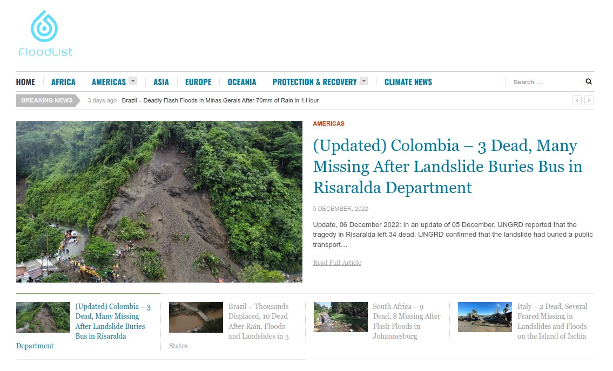

## Video: Conflicting Pole Shift Agendas Between...

Conflicting Pole Shift Agendas Between the East and West https://t.co/T3X2RARAjz

## "By the early 20th Century...

"By the early 20th Century almost one in every two people smoked, but the incidence of lung cancer remained so low that it was almost immeasurable. Then something extraordinary happened on July 16, 1945.." https://t.co/BMC5Zb4vgr

# Blog Post Excerpts, Curations

## Good Articles

Chan excerpts (tons of evidence in these):
- https://nobulart.com/cataclysms-revisited/
- https://nobulart.com/the-story-and-the-event/
- Chan does a good job of of dismantling (shredding) the incremental evolution narrative in this chapter.
	- https://nobulart.com/aftermath-evolution/

Musical harmonics:
- https://nobulart.com/musica-vitae-et-mortis/

What holds humanity back?:
- https://nobulart.com/what-holds-mankind-back-from-confronting-the-forces-determined-to-destroy-it/

Atkinson (Rosicrucians):
- https://nobulart.com/the-souls-progress/

Burgoyne:
- https://nobulart.com/the-hermetic-key/

Iron mountain excerpt

Vaccine:
Vaccine ingredients: https://nobulart.com/covid-19-vaccine-ingredients/

Cataclysms:
- The perfect storm: https://nobulart.com/the-perfect-storm/
- The flip of the earth https://nobulart.com/the-flip-of-the-earth/
- Velikovsky excerpt:
	- https://nobulart.com/east-west/

https://nobulart.com/666

https://nobulart.com/karma/

Politics:
- https://nobulart.com/the-first-kennedy-assassination/

https://nobulart.com/earth-changes/

## Kennedy Assassination

Why was the route changed at the very last minute to bring JFK along this particular road (with Zapruder already set up)? Because this was the spot that was prearranged for Mrs. Kennedy to discharge the chamber of a hand gun through her husband’s head... https://t.co/Jjyim34Ijy https://t.co/kG78qRDE40

See img/1693896664208068635-a5J_MAyupiUqOzX5.mp4.

## Heliobiology reccomendations

This is a small sample from over a hundred years of heliobiology research, Alexander Chizhevsky being considered the "father" of this science. 

Guy Beaujouan was also a pioneer in this field. I'm in the process of translating a portion of his L'Histoire et ses Méthodes (https://nobulart.com/media/9782072430787.pdf) which is a volume from the Encyclopédie de la Pléide. (https://en.wikipedia.org/wiki/Encyclop%C3%A9die_de_la_Pl%C3%A9iade) Heliobiology has been heavily suppressed in both the west, and in Russia. Chizhevsky was even imprisoned for some years because his work threatened the 'omnipotent' optic of the communist regime at the time. He is today considered to be a Russian hero.

- https://nobulart.com/the-solar-mind/
- https://nobulart.com/wrath-of-the-sun/
- https://nobulart.com/epidemics-during-grand-solar-minima/
- https://nobulart.com/using-cosmic-rays-to-predict-influenza-epidemics/
- https://nobulart.com/from-light-comes-darkness/

## Time portents

"Trivial omens give warning of trivial events, but the momentous historical events that attend the birth of a greater cycle in time are preceded by phenomena of a portentous nature, through which the least observant can scarcely fail to become aware of impending change."

[1] https://nobulart.com/time-portents/

## Thirty-Five Centuries Ago

In 1923–29, thirty-three miles north of Vero, in Melbourne, Florida, another such association of human remains and extinct animals was found, “a remarkably rich assemblage of animal bones, many of which represent species which became extinct at or after the close of the Pleistocene [Ice Age] epoch.” The discoverer, J. W. Gidley, of the United States National Museum, established unequivocally that in Melbourne – as in Vero – the human bones were of the same stratum and in the same state of fossilization as the bones of the extinct animals. And again human artifacts were found with the bones… But these conclusions require that the Ice Age ended only twenty-five to thirty-nine centuries ago.

https://nobulart.com/thirty-five-centuries-ago/

## The study of cycles

The Study of Cycles (https://nobulart.com/the-study-of-cycles/)
"The main manifestation of solar activity is the appearance of sunspots: powerful magnetic poles, they act as true particle accelerators. Electrons and positive ions projected to the surface of the earth are thus the cause of various electromagnetic disturbances which are capable of periodically influencing meteorology, crops, epidemics, crowd psychology, and consequently the course of history." - Guy Beaujouan (1961)
https://nobulart.com/the-study-of-cycles/

## South African Oppenheimers

“Robert Oppenheimer was a part of the Oppenheimer financiers that enabled the Rothschilds.” False. They’re not related at all. They only share a name. I know this because I have traced the lineage of the South African Oppenheimer family (https://nobulart.com/diamonds) all the way back to Solomon. They are of the Davidic line. During that process I also looked at RJO’s lineage specifically because I thought he was related. He does not share this lineage in any way or form. Oppenheimer is a popular surname. They’re not all blood relatives.

https://nobulart.com/the-diamond-empire/

## Nukes and tobacco

Not my authorship on this one, but I feel that Joe Vialls made some valid points in this. 
https://nobulart.com/nukes-and-tobacco

## Atlantis

https://nobulart.com/a-story-of-atlantis/

## Silent Weapons for Quiet Wars

https://nobulart.com/silent-weapons-for-quiet-wars/

## East and West

In the tomb of Senmut, the architect of Queen Hatshepsut, a panel on the ceiling shows the celestial sphere with the signs of the zodiac and other constellations in “a reversed orientation” of the southern sky.

The end of the Middle Kingdom antedated the time of Queen Hatshepsut by several centuries. The astronomical ceiling presenting a reversed orientation must have been a venerated chart, made obsolete a number of centuries earlier.

“A characteristic feature of the Senmut ceiling is the astronomically objectionable orientation of the southern panel.” The center of this panel is occupied by the Orion-Sirius group, in which Orion appears west of Sirius instead of east. “The orientation of the southern panel is such that the person in the tomb looking at it has to lift his head and face north, not south.” “With the reversed orientation of the south panel, Orion, the most conspicuous constellation of the southern sky, appeared to be moving eastward, i.e., in the wrong direction.”

The real meaning of “the irrational orientation of the southern panel” and the “reversed position of Orion” appears to be this: the southern panel shows the sky of Egypt as it was before the celestial sphere interchanged north and south, east and west. The northern panel shows the sky of Egypt as it was on some night of the year in the time of Senmut.

Immanuel Velikovsky (1950)
https://nobulart.com/East-West

## Shakespeare and Bacon

“If one man can be singled out as the person most responsible for the colonization of America, the honor would certainly fall to the head of both Masonry and Rosicrucianism of his era, Sir Francis Bacon. in the early 1600’s Bacon authored a novel entitled New Atlantis, which laid out the idea for a utopian society across the ocean from Europe where mankind could build a new civilization based upon the principles he believed to be those of the legendary lost continent of Atlantis.”
https://nobulart.com/shakespeare-bacon/

## Life, Liberty & Property (https://nobulart.com/life-liberty-property/)

“Although secret societies were very well organized and funded in early America, a formidable force arose to oppose them and quietly challenge their control of the developing nation. This force was the spiritual zeal of the Christian colonists.”
https://nobulart.com/life-liberty-property/

“I have heard much of the nefarious, and dangerous plan, and doctrines of the Illuminati, but never saw the Book until you were pleased to send it to me… I must correct an error you have run into, of my Presiding over the English lodges in this Country. The fact is, I preside over none, nor have I been in one more than once or twice, within the last thirty years.” - Letter from George Washington, American Mason, clearly delineating the moral difference between the European and the American Puritan/Pilgrim/Christian-dominated secret societies. 

## The exploded planet

We shoudn't forget the planet(s) that isn't/aren't there anymore.
https://nobulart.com/the-exploded-planet/

## The perfect storm

https://nobulart.com/the-perfect-storm/

## The birth of inequality

“All ran headlong to their chains, in hopes of securing their liberty; for they had just wit enough to perceive the advantages of political institutions, without experience enough to enable them to foresee the dangers.” - Jean-Jacques Rousseau (1755)
https://nobulart.com/the-birth-of-inequality/

## 360 days

Just a sample. There's more:
https://nobulart.com/360-days/

## Aftermath our precursor

Some of the observed effects of altering the electromagnetic environment around mammals, such as might occur during geomagnetic excursions or a weakening of the planet's geomagnetic field.
https://nobulart.com/aftermath-our-precursor/

## Tolstoy

## Great year

The Great Year (https://nobulart.com/the-great-year/)
“There is also a year which Aristotle calls Perfect, rather than Great, which is formed by the revolution of the sun, of the moon and of the five planets, when they all come at the same time to the celestial point from which they started together. This year has a great winter called by the Greeks the Inundation and by the Latins The Deluge; it has also a summer which the Greeks call the Conflagration of the world. The world is supposed to have been by turns deluged or on fire at each of these epochs.” – Censorinus (238 A.D)
https://nobulart.com/the-great-year

## Tesla's Pyramids

"Anyone able to manipulate resonant frequencies between 5 and 15 cycles per second (to 3 decimal places), can influence every dynamic electromagnetic activity on the face of the earth and beyond, including global weather, human thought... and behavior." https://t.co/fiv2sCyBzG

## Wrath of the Sun

9 times a century, for 2-3 years, without exception, Earth undergoes a convulsive shudder: floods, tornadoes, hurricanes, storms, earthquakes, landslides, volcanoes, auroras, electromagnetic storms, and the fires they cause in forests, steppes and cities. https://t.co/2uRCeMdksK

https://nobulart.com/wrath-of-the-sun/

## The Jones Plantation "The first...

The Jones Plantation "The first step in the revolution by the working class is to raise the ploletariat to the position of ruling class, to win the battle for democracy" - The Communist Manifesto, Karl Marx and Friedrich Engels [1] https://t.co/OlngjvTcbB https://t.co/dtma4TNYIS

## The Great Year “Early thinkers,...

The Great Year “Early thinkers, especially those of pre-Hellenic and early classical Greece, devised the concept of cyclical world history, which, because it postulated a succession of different ages, again involved the idea of great spans of time. These, though of vague… https://t.co/TwdVCOsjUD

## Cool fractal cataclysm viz

“Mathematically, the periodicity [of previous cataclysms] is a function of a helicoid“ - Chan Thomas (TAES)[1]. 
Inspired by this comment some years ago and created really as a lark: I started with the very long term geophysical events going back >100ka and found a pretty good helical fit around 1.0768. As I wound it back towards its nexus, I included many of the more recent great wars, epidemics, genocides and flood myths which fell near the crossings (to see whether Alexander Chizhevsky's [2] cyclic sociology concepts might become apparent in this as well). Shown here in reverse. There are many events not shown here.
1. https://nobulart.com/cataclysms-revisited/
2. https://nobulart.com/the-solar-mind/

See img/1807372083858464795-zS0Z6iPujZ2z8Itt.mp4.

## "Although secret societies were very...

"Although secret societies were very well organized and funded in early America, a formidable force arose to oppose them and quietly challenge their control of the developing nation. This force was the spiritual zeal of the Christian colonists." https://t.co/YlBPixTsSK

## "I think that the Deagel...

"I think that the Deagel 2025 Forecast figures are based on an assumption, or perhaps knowledge, that there is a storm coming – the confluence of genocide, manufactured chaos, and anticipated earth changes." - Me (2021) https://t.co/R3UzWhRkfR https://t.co/1RIAM8f90S

## “If one man can be...

“If one man can be singled out as the person most responsible for the colonization of America, the honor would certainly fall to the head of both Masonry and Rosicrucianism of his era, Sir Francis Bacon." - William T. Still (1991) https://t.co/tewE5d6Cqf

## "War is not, as is...

"War is not, as is widely assumed, primarily an instrument of policy utilized by nations to extend or defend their expressed political values or their economic interests." - Report from Iron Mountain (1967) https://t.co/yPdUOpL5Oo

## Trivial omens warn of trivial...

Trivial omens warn of trivial events, but the momentous historical events that attend the birth of a greater cycle in time are preceded by phenomena of a portentous nature, through which the least observant cannot fail to become aware of impending change. https://t.co/feUswfCWu6

## "666 has been the subject...

"666 has been the subject of more comment and speculation than any other cabalistic number, principally on account of the last verse of Revelation 13." https://t.co/oDMuyOLMJS

## "The Globalists and their Malthusian,...

"The Globalists and their Malthusian, Flying Monkey Greens are anti-human, anti-God, they want to reduce the Global population... to 1 billion people. To see the future all you need do now is follow the trend to an obvious conclusion." - Andrew Quin https://t.co/Uy3qlj7Jbc

## “Cancer was practically unknown until...

“Cancer was practically unknown until compulsory vaccination with cowpox vaccine began to be introduced. I have had to deal with a least two hundred cases of cancer, and I never saw a case of cancer in an unvaccinated person.” - Dr. W. B. Clarke https://t.co/8ZanOWCdrt

## “The idols and false notions...

“The idols and false notions which are now in possession of the human understanding, and have taken deep root therein, not only so beset men’s minds that truth can hardly find entrance..” – Francis Bacon (1620) https://t.co/B91tZBoMQU

## “This personage, as is the...

“This personage, as is the way among mankind, was more valued after his death than while he lived. His enemies were courtiers residing at London, while his admirers consisted wholly of foreigners.” – Voltaire (1733) https://t.co/HLQAOJhq9p

## “The ancient Atlantean texts, have...

“The ancient Atlantean texts, have their own predictions about what will occur regarding Earth changes in the next few years. There are also predictions about socioeconomic changes.” – Jon Peniel (1991) https://t.co/l10sY4XJOQ

## “‘Every state is founded on...

“‘Every state is founded on force,’ said Trotsky... We have to say that today a STATE is a human community that (successfully) claims the monopoly of the legitimate use of physical force within a given territory.” - Max Weber (1918) https://t.co/1dBVlOigL7

## “The next coming reset may...

“The next coming reset may be the largest and most important of all and is often referred to as the Plasma Apocalypse or Pole Shift.” – Brian Austin Lambert https://t.co/mPoSJ3rBQN #poleshift

## "The ability for each individual...

"The ability for each individual to develop their mental capacity has most evidently been subverted over past centuries." Richard Grove, The Occulted Keys of Wisdom (2011) https://t.co/ALhpWN15yq

## RT "Early in 2023, genomics...

RT "Early in 2023, genomics scientist Kevin McKernan made an accidental discovery. While running an experiment in his Boston…

## “The hypothesis of the explosion...

“The hypothesis of the explosion of a number of planets and moons of our solar system during its 4.6-billion-year history is in excellent accord with all known observational constraints, even without adjustable parameters.” https://t.co/v40radMJxe

## "Should this sizeable number of...

"Should this sizeable number of [reported] fatalities be confirmed, the COVID-19 vaccines would constitute the largest biological safety disaster in human history." https://t.co/Zp3k14Arr3

## MindWar https://t.co/gvQmsEY4YA "Unlike PSYOP, MindWar...

MindWar https://t.co/gvQmsEY4YA "Unlike PSYOP, MindWar has nothing to do with deception or even with “selected” – and therefore misleading – truth. Rather it states a whole truth that, if it does not now exist, will be forced into existence by the will of the United States."

## Immortality Day “Immortality Day” was...

Immortality Day “Immortality Day” was first published in 1912 under the title “Immortal Fride: A. Bogdanov's Fantastic Narrative”. https://t.co/MspBwDrqDF

## Epidemics During Grand Solar Minima...

Epidemics During Grand Solar Minima https://t.co/ITQGnjVzVm

## #CholeraOutbreak “Chizhevsky, in his work,...

#CholeraOutbreak “Chizhevsky, in his work, pointed out the connection between cycles of cholera outbreaks and outbreaks of solar activity.” https://t.co/48JDqzLAbY “The Sun... Could Be In Its Strongest Cycle Since Records Began“ https://t.co/QohR6nqL11

## "Hardly had the swine flu...

"Hardly had the swine flu campaign been completed than the reports of the casualties began to pour in. Within a few months, claims totalling $1.3 billion had been filed by victims who had suffered paralysis from the swine flu vaccine." - Eustace Mullins https://t.co/O2YKOlpWml

## "If the word government literally...

"If the word government literally means 'to control the mind', therefore wouldn’t learning how to control your own mind negate the opportunity for external government?" - Richard Grove (2011) https://t.co/ALhpWN15yq

## "The institution of religion exists...

"The institution of religion exists only to keep mankind in order, and to make men merit the goodness of God by their virtue. Everything in a religion which does not tend toward this goal must be considered alien or dangerous." - Voltaire (1764) https://t.co/tQ5SJovfi9

## “The emblematical meaning of the...

“The emblematical meaning of the Sun is well known to the enlightened and inquisitive Free-Mason; and as the real Sun is situated in the center of the universe, so the emblematical Sun is the center of real Masonry." https://t.co/V5T0PxE7Z8

## “When a man has so...

“When a man has so far corrupted and prostituted the chastity of his mind as to subscribe his professional belief to things he does not believe, he has prepared himself for the commission of every other crime." - Thomas Paine (1794) https://t.co/JdboKbDM5L

## "Laziness and cowardice are the...

"Laziness and cowardice are the reasons why so great a portion of mankind remain under tutelage, and why it is so easy for others to set themselves up as their guardians." - Immanuel Kant (1784) https://t.co/FQbmiLuwAU

## "The people’s world today is...

"The people’s world today is like a machine with a million gears, and every tooth on every gear is calculated to drive us into a collective dependent mindless herd with an automatic response to authority." - Jeff Chiacchieri (2017) https://t.co/qy6vEB6OKU

## A story of Atlantis by...

A story of Atlantis by W.P Phelon (1903) https://t.co/BETUgNCJES

## "More than three-quarters of all...

"More than three-quarters of all instances of human unrest—battles, upheavals, riots, revolutions, and wars—occur during the periods of the maximum number of sunspots in the Sun." https://t.co/wdKdH72jw4

## "The wise man will not...

"The wise man will not go where he is not wanted, nor be so blindly foolish as to attend the funeral of his own joy." - Thomas H. Burgoyne, The Mysteries of Eros (1887) https://t.co/WtUXsc0KXH

## Treacherous beings produce the greatest...

Treacherous beings produce the greatest portion of the suffering and misery which afflicts humanity. The time has now come when certain facts in regard to this orb of evil are for the first time given out to the world “pro bono publico.” https://t.co/oevdGQ6Uuo

## “By the early 20th Century...

“By the early 20th Century almost one in every two people smoked, but the incidence of lung cancer remained so low that it was almost immeasurable. Then something extraordinary happened on July 16, 1945..” https://t.co/xnmfOmjLFi

## “Perhaps, with another geological upheaval...

“Perhaps, with another geological upheaval facing us, we are now once again on the verge of a new quantum leap in what we might call “creative evolution”, or transitioning to the next higher stage in human development.“ https://t.co/BCrSN0Chc3

## “The consensus opinion was to...

“The consensus opinion was to distribute this to as many people as who wanted it, to the end that they would not only understand that “War” had been declared against them, but would be able to properly identify the true enemy to Humanity.” https://t.co/ucQOS1NCfW

## "Lust is not love. Lust...

"Lust is not love. Lust is the animal or passional appetite, with nothing human about it, and woe be to those whose love cannot rise above the plane of lust." - Thomas H. Burgoyne (1889) https://t.co/wFoNMIMAr2

## "Unless we wake up to...

"Unless we wake up to the absurdity of the motivating narrative, this is likely only to be the beginning of the disasters that will follow from the current irrational demonization of CO₂.” - Prof. Richard Lindzen https://t.co/gnV4LmzPDc https://t.co/PhdPBx0Unf

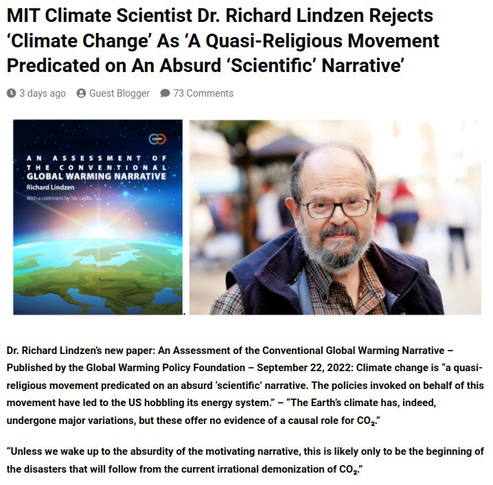

## "ALWAYS remain the complete master...

"ALWAYS remain the complete master of your own organism at any cost. Once you submit to hypnosis or any control, it is difficult to free yourself, and the oftener you submit the weaker you become until you are no longer able to make any decision for yourself." T.H Burgoyne (1889) https://t.co/U0mGjsdAV5

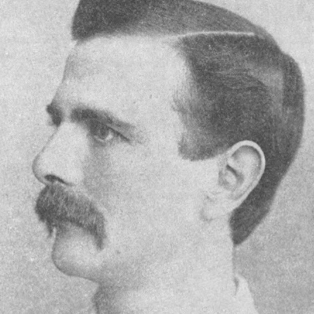

## "The walls of the mighty...

"The walls of the mighty Babylon and the eight-volved Tower of Babel or cloud-encompassed Bel were never constructed to resist any mortal foe. NO. Those city walls were not made to defy the strength of armies, but to resist the fearful forces of Nature..." https://t.co/DJGOtcMlG6

## Guest: Dr. Aseem Malhotra
https://t.co/15QF8Tplaj

Guest: Dr. Aseem Malhotra https://t.co/15QF8Tplaj

## “It simply doesn’t get any...

“It simply doesn’t get any more clear than this that the people responsible for safety monitoring at the CDC are either incompetent, corrupt, or both.” - Steve Kirsch https://t.co/B96qSfN3WX

## CIA Director John Brennan, 29...

CIA Director John Brennan, 29 June 2016, Stratospheric Aerosol Injection (SAI) Geoengineering. https://t.co/CdwPze1foG https://t.co/x4A3YuOyQP

See img/1597139480972259328-2PrNmMf5ZqwJHFfl.mp4.

## "Somewhere between Darwinian evolutionary dogma,...

"Somewhere between Darwinian evolutionary dogma, good-old-boy peer reviews, and powerful sub rosa occult societies, a decision was made to eliminate æther from mainstream science and replace it with space as a vacuum.." https://t.co/ejIjdHzcWo

## "...the aim of public education...

"...the aim of public education is not to fill the young of the species with knowledge and awaken their intelligence. ... Nothing could be further from the truth." H.L Mencken (1924) https://t.co/D0fLPLg5IY

## Silent Weapons for Quiet Wars...

Silent Weapons for Quiet Wars https://t.co/ucQOS1N4qo

## Artificial Intelligence is the technology...

Artificial Intelligence is the technology that will build the Akashic Library. https://t.co/6DW1B3Bcr9

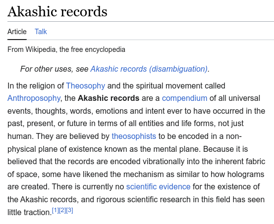

## Interactive chart I created in...

Interactive chart I created in October 2021 visualizing all 34,856 VAERS death reports spanning the period 1988 - October 2021, broken down by vaccine type and manufacturer. Interactive chart is here: https://t.co/4ZzSupnHjA https://t.co/ICJu0SjpLu

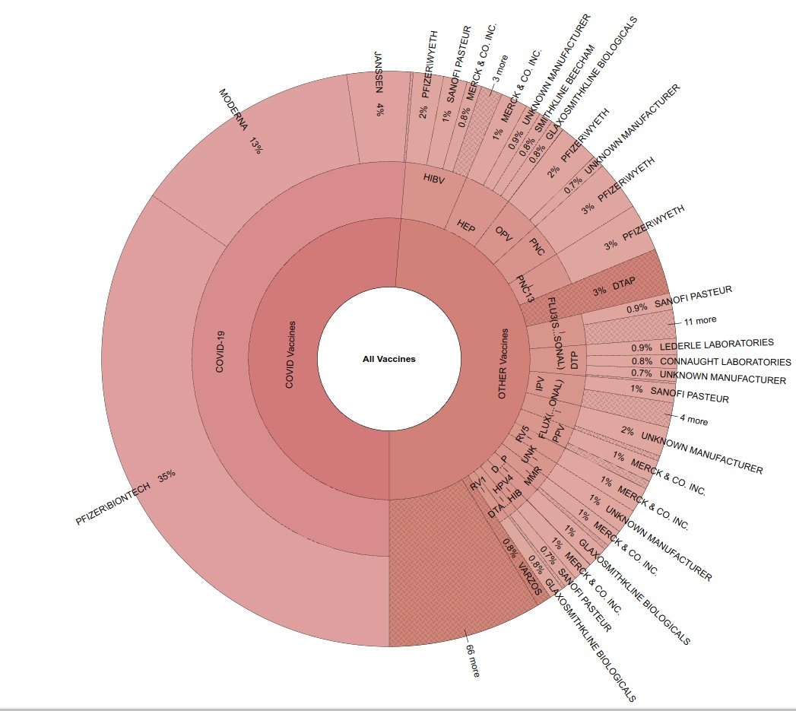

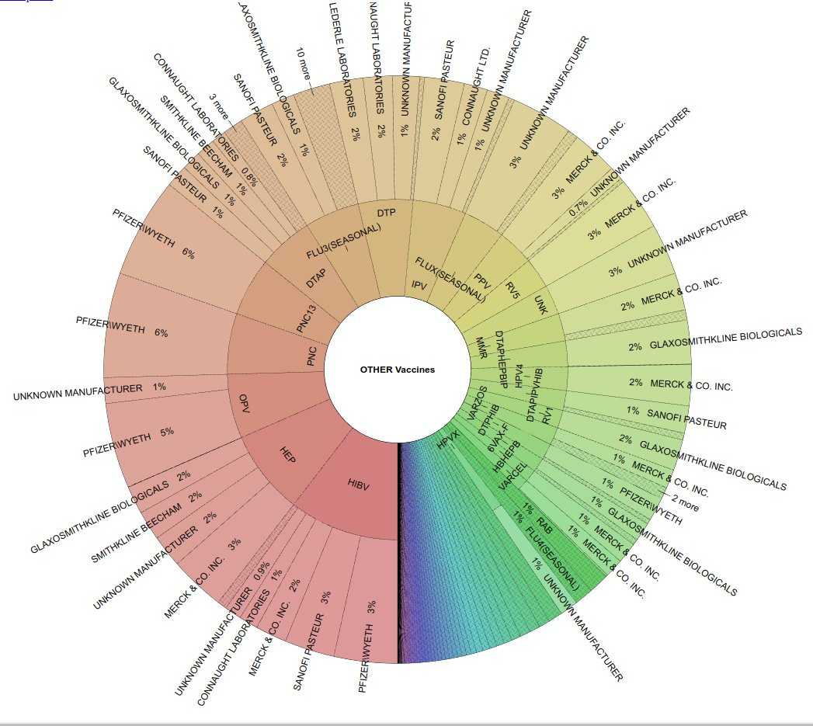

## Ignore the patients that died...

Ignore the patients that died after treatment, and claim that the 'therapy' works. Sound familiar? Only this was more than a century ago. Seems that Pfizer took a page out of Pasteur's book of tricks. https://t.co/AW72eoeA0r https://t.co/JFMgwRmAsl

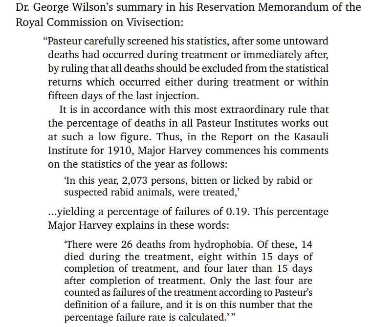

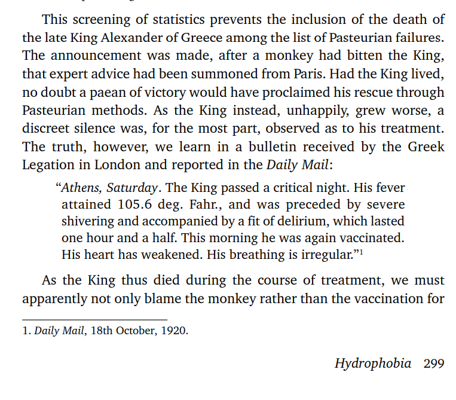

### https://t.co/Zzo6PA0q5j https://t.co/WBi3D91Gg3

https://t.co/Zzo6PA0q5j https://t.co/WBi3D91Gg3

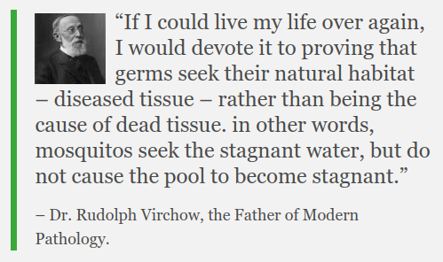

## The yoke of humanity's enslavement...

The yoke of humanity's enslavement lies in the knowledge which has been occulted and weaponized against us for thousands of years. https://t.co/feUswfCWu6 https://t.co/gdJjBwNWz1

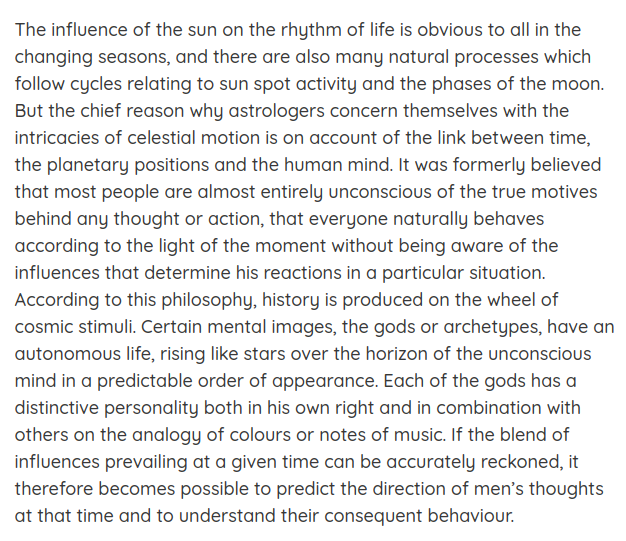

## "the advertising material for the...

"the advertising material for the trial and the informed consent forms stated that the placebo was saline or an inactive substance, when, in fact, it contained Merck’s proprietary highly reactogenic aluminum adjuvant" https://t.co/bogXNURdIb https://t.co/cOr5DyHlTP

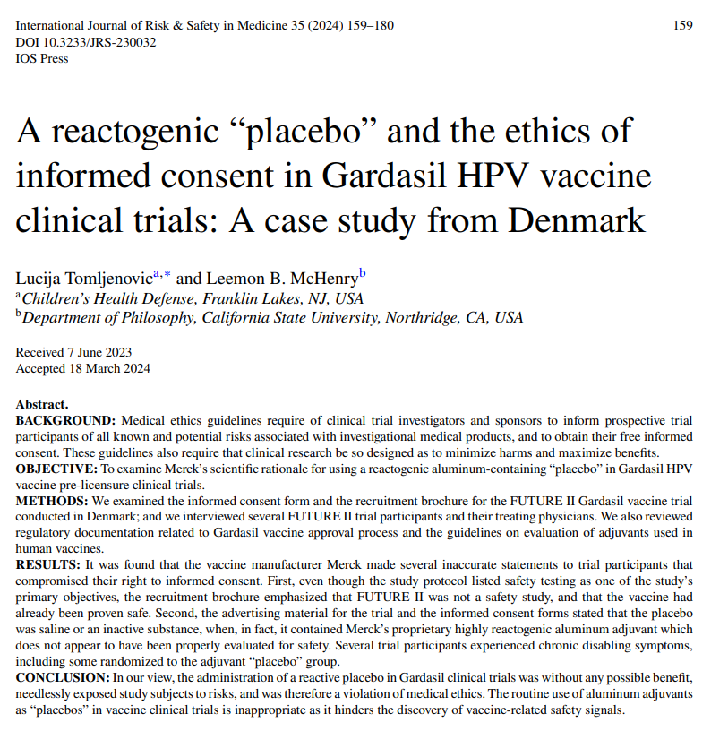

## "In order to topple a...

"In order to topple a country, you need three things; time, distraction and traitors from within." https://t.co/mzE5nF8BQ6

## Trypanasoma is a microscopic parasite...

Trypanasoma is a microscopic parasite which has numerous non-specific symptoms, is seldom tested for and if left untreated is almost always fatal within a few years of infection. Is this the perfect bioweapon? https://t.co/BIxAoT6QSK

## RT "Give me control over...

RT "Give me control over a nation’s currency, and I care not who makes its laws." – Mayer Amschel Rot…

## https://t.co/Zzo6PA0q5j https://t.co/19wvldaEq3

https://t.co/Zzo6PA0q5j https://t.co/19wvldaEq3

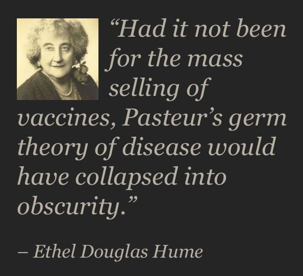

## Beethoven's involvement in Freemasonry and...

Beethoven's involvement in Freemasonry and its ideals pointed the way for a new view of music. The impact of such a trend cannot be underestimated - it is one of the most direct and significant catalysts in many aspects of the following era. https://t.co/2dHhUbLJFH

## 'As of today, Saturday, November...

'As of today, Saturday, November 20th [2021], all of those naked tyrants have exposed themselves to be nothing but bribed and blackmailed puppets of “Klaus Schwab’s School For Covid Dictators”.' https://t.co/a3Xlv9WIUS

## Karma is powerless to effect...

Karma is powerless to effect good or evil upon the external plane. But, upon the interior plane, the astral sphere of the disembodied soul world, karma becomes the Book of Life from which all our actions in this world are judged. https://t.co/Tc12xC38IZ