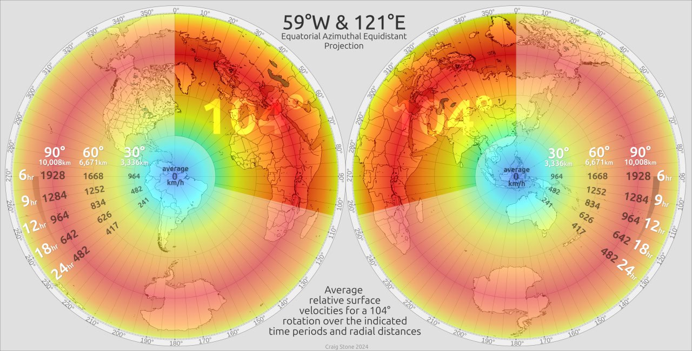
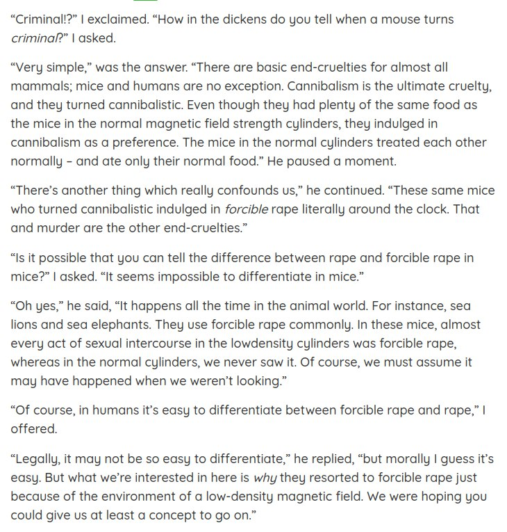

# Nobulart

A close follower of the ECDO theory with a lot of relevant material on his [website](https://nobulart.com/). Has also created several excellent ECDO rotation visualizations which are embedded throughout the repo.

## Contents

-`ecdo-visualizations`: ECDO rotation visualization videos made by Nobulart.

## Rotation Speed 2D Viz

ECDO // Relative Velocity Map presented as azimuthal equidistant projections, light and dark versions [1] centred on the ECDO Euler (pivots) at 0°N, 59°W and 0°N, 121°E. Average relative velocities are expressed in kilometres per hour for a 104° rotation, according to distance from the nearest pivot, and the duration of the rotation (anywhere from 6-24 hours in this calculation). 

A rotation would involve acceleration and deceleration - a parabolic curve - suggesting that the shear-forces between land, water and crust would be dispersed over the period of the rotation. It would take some time to reach, exceed, and the drop back down below these averages. These numbers provide a rough guide only. Variations in geography would dramatically influence local conditions in many places. The ECDO hypothesis is described at [2].

The maps are from https://ns6t.net/azimuth/azimuth.html

I use boxySVG for most of the layout and compositing. It’s nimble and efficient for most tasks.

1. https://t.me/nobulart/2630
2. https://ns6t.net/azimuth/azimuth.html
3. https://theethicalskeptic.com/2024/05/12/exothermic-core-mantle-decoupling-dzhanibekov-oscillation-ecdo-theory/ .

### V4.0 Resources : [1] https://t.co/KvDmD5ZCGS...

V4.0 Resources : [1] https://t.co/KvDmD5ZCGS (521 MB) [2] https://t.co/ccM8H1Lmar (113 MB) [3] https://t.co/hMiBgL05jk (17 MB - some overlays for use in Google Earth Pro)

## Time portents

"Trivial omens give warning of trivial events, but the momentous historical events that attend the birth of a greater cycle in time are preceded by phenomena of a portentous nature, through which the least observant can scarcely fail to become aware of impending change."

[1] https://nobulart.com/time-portents/

## Thirty-Five Centuries Ago

In 1923–29, thirty-three miles north of Vero, in Melbourne, Florida, another such association of human remains and extinct animals was found, “a remarkably rich assemblage of animal bones, many of which represent species which became extinct at or after the close of the Pleistocene [Ice Age] epoch.” The discoverer, J. W. Gidley, of the United States National Museum, established unequivocally that in Melbourne – as in Vero – the human bones were of the same stratum and in the same state of fossilization as the bones of the extinct animals. And again human artifacts were found with the bones… But these conclusions require that the Ice Age ended only twenty-five to thirty-nine centuries ago.

https://nobulart.com/thirty-five-centuries-ago/

## Heliobiology reccomendations

This is a small sample from over a hundred years of heliobiology research, Alexander Chizhevsky being considered the "father" of this science. 

Guy Beaujouan was also a pioneer in this field. I'm in the process of translating a portion of his L'Histoire et ses Méthodes (https://nobulart.com/media/9782072430787.pdf) which is a volume from the Encyclopédie de la Pléide. (https://en.wikipedia.org/wiki/Encyclop%C3%A9die_de_la_Pl%C3%A9iade) Heliobiology has been heavily suppressed in both the west, and in Russia. Chizhevsky was even imprisoned for some years because his work threatened the 'omnipotent' optic of the communist regime at the time. He is today considered to be a Russian hero.

- https://nobulart.com/the-solar-mind/
- https://nobulart.com/wrath-of-the-sun/
- https://nobulart.com/epidemics-during-grand-solar-minima/
- https://nobulart.com/using-cosmic-rays-to-predict-influenza-epidemics/
- https://nobulart.com/from-light-comes-darkness/

## The study of cycles

The Study of Cycles (https://nobulart.com/the-study-of-cycles/)
"The main manifestation of solar activity is the appearance of sunspots: powerful magnetic poles, they act as true particle accelerators. Electrons and positive ions projected to the surface of the earth are thus the cause of various electromagnetic disturbances which are capable of periodically influencing meteorology, crops, epidemics, crowd psychology, and consequently the course of history." - Guy Beaujouan (1961)
https://nobulart.com/the-study-of-cycles/

## South African Oppenheimers

“Robert Oppenheimer was a part of the Oppenheimer financiers that enabled the Rothschilds.” False. They’re not related at all. They only share a name. I know this because I have traced the lineage of the South African Oppenheimer family (https://nobulart.com/diamonds) all the way back to Solomon. They are of the Davidic line. During that process I also looked at RJO’s lineage specifically because I thought he was related. He does not share this lineage in any way or form. Oppenheimer is a popular surname. They’re not all blood relatives.

https://nobulart.com/the-diamond-empire/

## Nukes and tobacco

Not my authorship on this one, but I feel that Joe Vialls made some valid points in this. 
https://nobulart.com/nukes-and-tobacco

## Atlantis

https://nobulart.com/a-story-of-atlantis/

## Silent Weapons for Quiet Wars

https://nobulart.com/silent-weapons-for-quiet-wars/

## East and West

In the tomb of Senmut, the architect of Queen Hatshepsut, a panel on the ceiling shows the celestial sphere with the signs of the zodiac and other constellations in “a reversed orientation” of the southern sky.

The end of the Middle Kingdom antedated the time of Queen Hatshepsut by several centuries. The astronomical ceiling presenting a reversed orientation must have been a venerated chart, made obsolete a number of centuries earlier.

“A characteristic feature of the Senmut ceiling is the astronomically objectionable orientation of the southern panel.” The center of this panel is occupied by the Orion-Sirius group, in which Orion appears west of Sirius instead of east. “The orientation of the southern panel is such that the person in the tomb looking at it has to lift his head and face north, not south.” “With the reversed orientation of the south panel, Orion, the most conspicuous constellation of the southern sky, appeared to be moving eastward, i.e., in the wrong direction.”

The real meaning of “the irrational orientation of the southern panel” and the “reversed position of Orion” appears to be this: the southern panel shows the sky of Egypt as it was before the celestial sphere interchanged north and south, east and west. The northern panel shows the sky of Egypt as it was on some night of the year in the time of Senmut.

Immanuel Velikovsky (1950)
https://nobulart.com/East-West

## Shakespeare and Bacon

“If one man can be singled out as the person most responsible for the colonization of America, the honor would certainly fall to the head of both Masonry and Rosicrucianism of his era, Sir Francis Bacon. in the early 1600’s Bacon authored a novel entitled New Atlantis, which laid out the idea for a utopian society across the ocean from Europe where mankind could build a new civilization based upon the principles he believed to be those of the legendary lost continent of Atlantis.”
https://nobulart.com/shakespeare-bacon/

## Life, Liberty & Property (https://nobulart.com/life-liberty-property/)

“Although secret societies were very well organized and funded in early America, a formidable force arose to oppose them and quietly challenge their control of the developing nation. This force was the spiritual zeal of the Christian colonists.”
https://nobulart.com/life-liberty-property/

“I have heard much of the nefarious, and dangerous plan, and doctrines of the Illuminati, but never saw the Book until you were pleased to send it to me… I must correct an error you have run into, of my Presiding over the English lodges in this Country. The fact is, I preside over none, nor have I been in one more than once or twice, within the last thirty years.” - Letter from George Washington, American Mason, clearly delineating the moral difference between the European and the American Puritan/Pilgrim/Christian-dominated secret societies. 

## The exploded planet

We shoudn't forget the planet(s) that isn't/aren't there anymore.
https://nobulart.com/the-exploded-planet/

## The perfect storm

https://nobulart.com/the-perfect-storm/

## The birth of inequality

“All ran headlong to their chains, in hopes of securing their liberty; for they had just wit enough to perceive the advantages of political institutions, without experience enough to enable them to foresee the dangers.” - Jean-Jacques Rousseau (1755)
https://nobulart.com/the-birth-of-inequality/

## 360 days

Just a sample. There's more:
https://nobulart.com/360-days/

## Aftermath our precursor

Some of the observed effects of altering the electromagnetic environment around mammals, such as might occur during geomagnetic excursions or a weakening of the planet's geomagnetic field.
https://nobulart.com/aftermath-our-precursor/

## Tolstoy

## Great year

The Great Year (https://nobulart.com/the-great-year/)
“There is also a year which Aristotle calls Perfect, rather than Great, which is formed by the revolution of the sun, of the moon and of the five planets, when they all come at the same time to the celestial point from which they started together. This year has a great winter called by the Greeks the Inundation and by the Latins The Deluge; it has also a summer which the Greeks call the Conflagration of the world. The world is supposed to have been by turns deluged or on fire at each of these epochs.” – Censorinus (238 A.D)
https://nobulart.com/the-great-year

## Video: Conflicting Pole Shift Agendas Between...

Conflicting Pole Shift Agendas Between the East and West https://t.co/T3X2RARAjz

## Tesla's Pyramids

"Anyone able to manipulate resonant frequencies between 5 and 15 cycles per second (to 3 decimal places), can influence every dynamic electromagnetic activity on the face of the earth and beyond, including global weather, human thought... and behavior." https://t.co/fiv2sCyBzG

## Wrath of the Sun

9 times a century, for 2-3 years, without exception, Earth undergoes a convulsive shudder: floods, tornadoes, hurricanes, storms, earthquakes, landslides, volcanoes, auroras, electromagnetic storms, and the fires they cause in forests, steppes and cities. https://t.co/2uRCeMdksK

https://nobulart.com/wrath-of-the-sun/

## Good Articles

Chan excerpts (tons of evidence in these):
- https://nobulart.com/cataclysms-revisited/
- https://nobulart.com/the-story-and-the-event/
- Chan does a good job of of dismantling (shredding) the incremental evolution narrative in this chapter.
	- https://nobulart.com/aftermath-evolution/

Musical harmonics:
- https://nobulart.com/musica-vitae-et-mortis/

What holds humanity back?:
- https://nobulart.com/what-holds-mankind-back-from-confronting-the-forces-determined-to-destroy-it/

Atkinson (Rosicrucians):
- https://nobulart.com/the-souls-progress/

Burgoyne:
- https://nobulart.com/the-hermetic-key/

Iron mountain excerpt

Vaccine:
Vaccine ingredients: https://nobulart.com/covid-19-vaccine-ingredients/

Cataclysms:
- The perfect storm: https://nobulart.com/the-perfect-storm/
- The flip of the earth https://nobulart.com/the-flip-of-the-earth/
- Velikovsky excerpt:
	- https://nobulart.com/east-west/

https://nobulart.com/666

https://nobulart.com/karma/

Politics:
- https://nobulart.com/the-first-kennedy-assassination/

https://nobulart.com/earth-changes/
