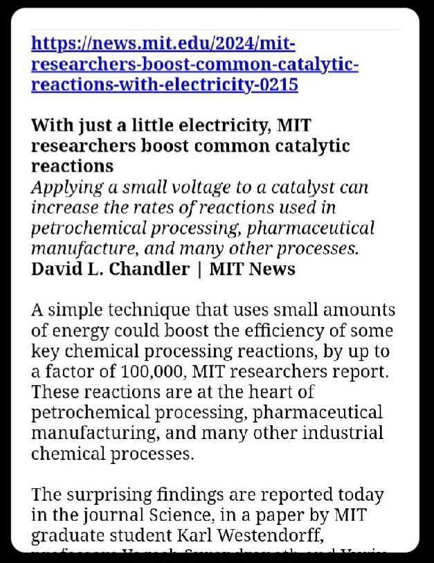

# Rex Research

rexresearch.com

Fair warning, its not very user friendly.

I found it because I was trying to find remnants of a mention of some kind of tech that changes genetic expression in plants to their "primitive" forms with the bonus of increased physical aptitude through an electromagnetic field. I saw it in a twitter post back in 2017 and then the account disappeared. I switched to Yandex browser in 2022, and after some 20 minutes I was able to find the paper and patent from Guido Ebner in rexresearch's website. It has practically been scrapped from the internet otherwise.

I check it every few days and the old man recently updated it with this:

HIGHLY relevant to the pyramid paper in the chemistry topic.

I was just yandex'ing graviflyer and came across http://rexresearch.com/chekurkov/chekurkov.html . Still trying to understand its principles of operation.

This is the index: https://rexresearch1.com/