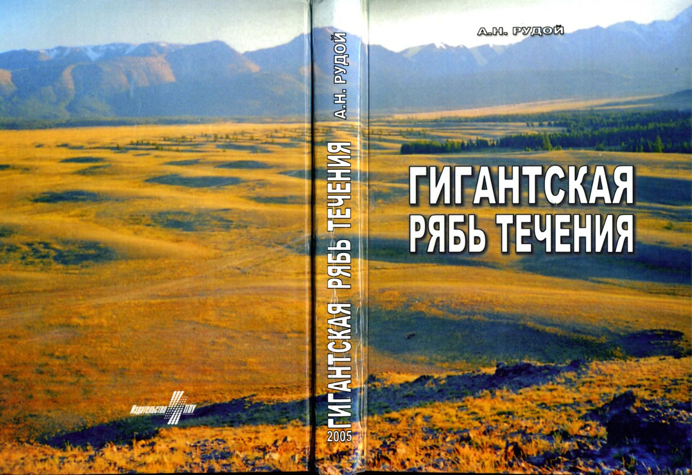
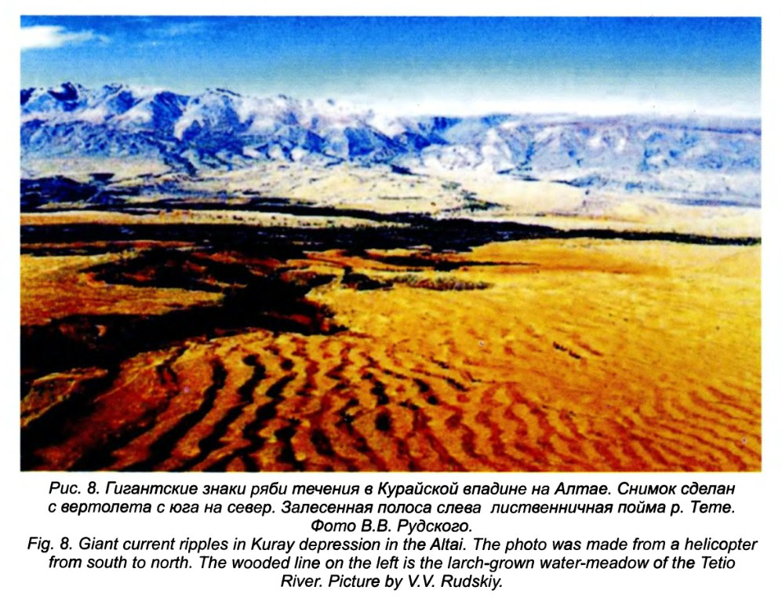
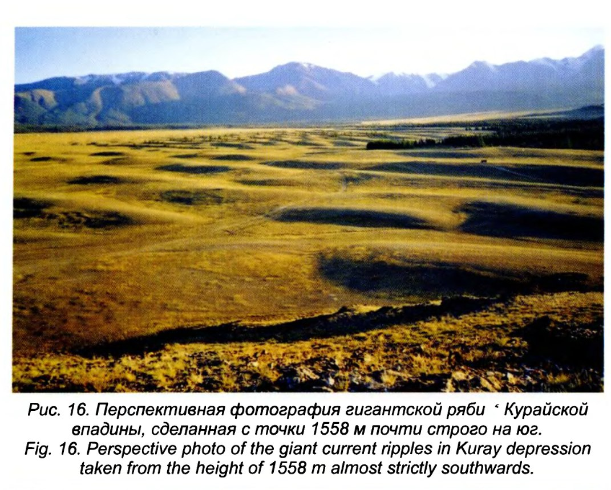
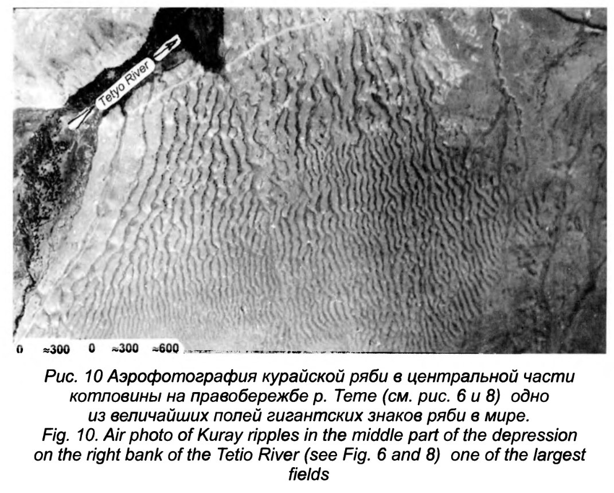

# Rudoy

An interesting find: Giant Current Ripples (research history, diagnostics, paleogeographical significance) by A.N Rudoy (2005). Fortunately the entire book is presented in both Russian and English.

