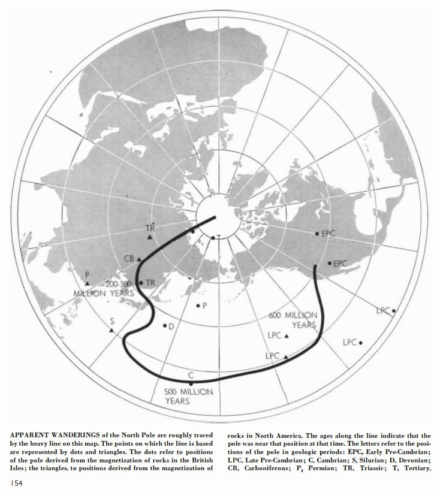
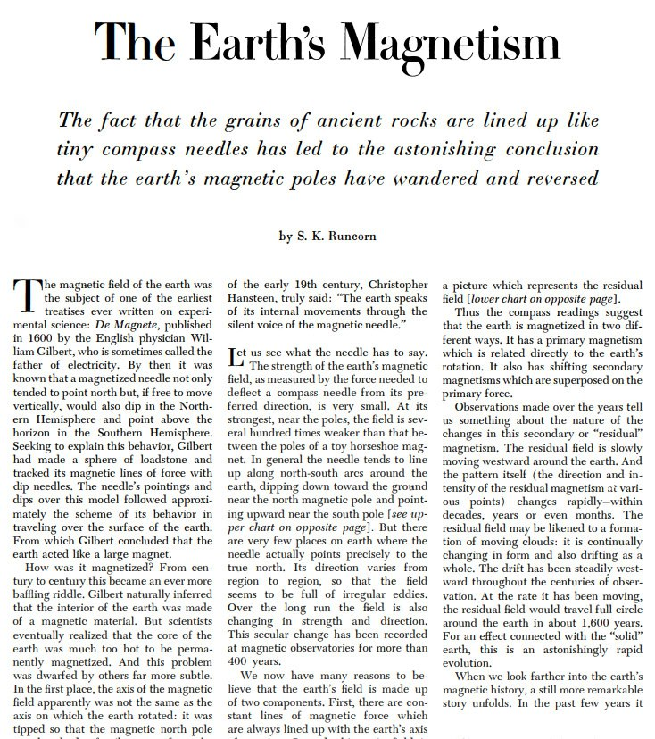

# Runcorn

"Whatever the mechanism, there seems no doubt that the earth's field is tied up in some way with the rotation of the planet. And this leads to a remarkable finding about the earth's rotation itself. Aside from the complete reversals, or flip-flops, of the magnetic field, the magnetic poles have wandered gradually throughout the period of magnetic history readable in the rocks. We can only suppose from this that the earth's axis of rotation has changed also. In other words, the planet has rolled about, changing the location of its geographic poles [see map on page 154]. Either mountain building or convection currents in the mantle might account for this rolling. If the hypotheSis of the wandering poles is verified, naturally it will be of great importance to geologists. It may explain, for example, the known fact that in the remote geological past there were glaciers near the present equator." - S.K. Runcorn, The Earth's Magnetism (1955)

[1] https://sci-hub.ru/10.1038/scientificamerican0955-152