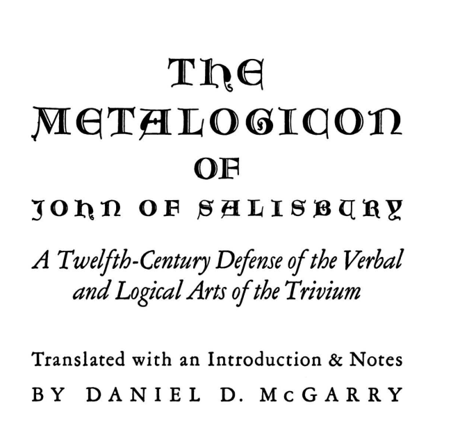

# Salisbury

## "Just as it is more...

"Just as it is more within one's power to love wisdom than to attain it, so too it is easier to love reason than to possess it. 'To have reason,' that is, to possess genuine judgment, is the lot of few." - Metalogicon, John of Salisbury (1159 A.D) https://t.co/oBvapLxsG4 [90mb] https://t.co/ZZrveeZE9B

