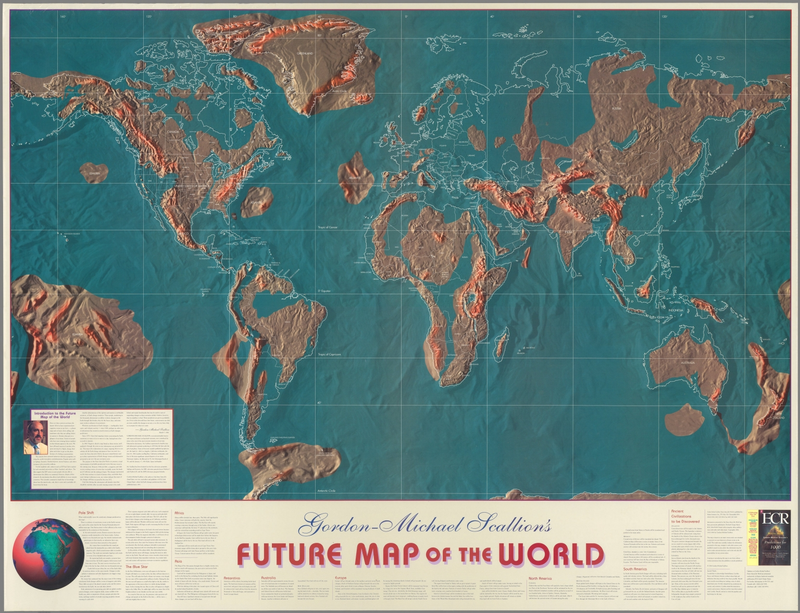

# Gordon Michael Scallion

Known as a "contemporary prophet", he has published theories on flooding, earthquakes, and volcanoes. May be worth looking into.

Apparently he used to run the "Matrix Institute" in New Hampshire but I can't find it.

## "Doomsday" Flood Map

Source: https://archive.org/details/dr_future-map-of-the-world-10902000

## Forbes Article

Forbes article which is very interesting. Hard copy in `articles`:
- https://www.forbes.com/sites/jimdobson/2017/06/10/the-shocking-doomsday-maps-of-the-world-and-the-billionaire-escape-plans/
