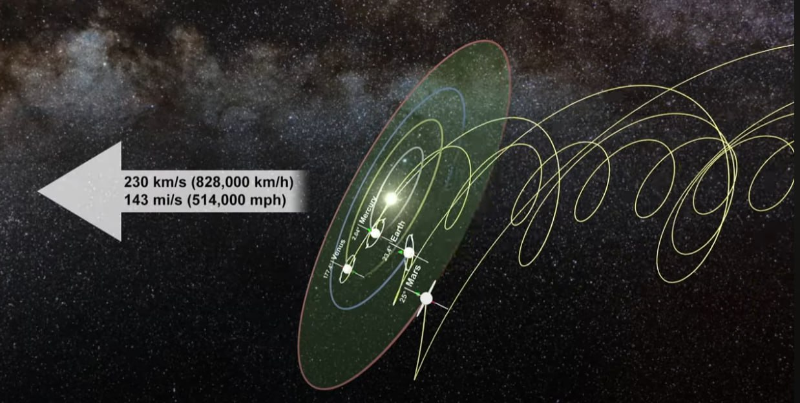
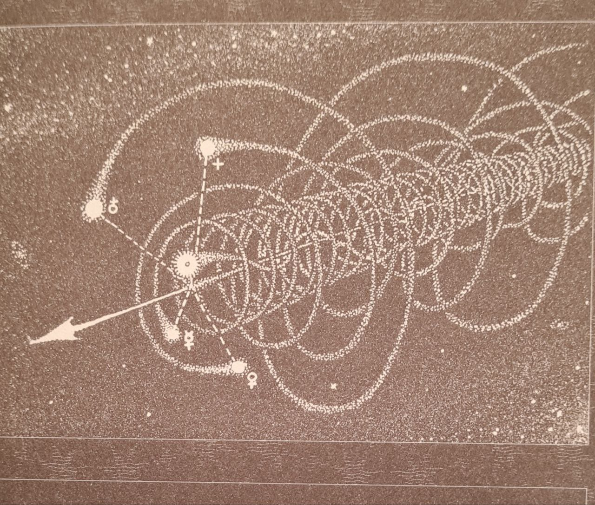

# Robert Scoch

Interesting article he has here: https://www.robertschoch.com/ulissey_aquarius.html

I have been thinking more about aquarius and water/oil/fire/spirit

https://m.youtube.com/watch?v=-uPNMO-YA5E

Joel 2

I will pour out My Spirit in those days.
30 (https://biblehub.com/joel/2-30.htm)) I will show wonders in the heavens and on the earth,
blood and fire and columnsg (https://biblehub.com/bsb/joel/2.htm#fn) of smoke.
31 (https://biblehub.com/joel/2-31.htm)) The sun will be turned to darkness
and the moon to blood
before the coming of the great and awesomeh (https://biblehub.com/bsb/joel/2.htm#fn) Day of the LORD.
32 (https://biblehub.com/joel/2-32.htm)) And everyone who calls on the name of the LORD
will be saved

Matthew 3:11

I baptize you with water for repentance, but he who is coming after me is mightier than I, whose sandals I am not worthy to carry. He will baptize you with the Holy Spirit and fire.

Ha, did you see this?  I was reading his Aquarius article more closely...

"How does this all connect to Aquarius? Isotope levels – one way to measure the activity of the Sun – indicate that our star today is showing the same signs of agitation now that it did 12,000 years ago, with nothing comparable in between.3 12,000 years ago, approximately one half of a precessional cycle, our last ice age ended, and advanced culture was brought to its knees, when a river of fire (solar plasma) emanated from our Sun and washed over our planet, leaving little more than large stones standing. Will we be hit again? Geology teaches that it is not a matter of if, but when. The question is, will the world be prepared? And knowing that such an event is coming, what will our civilization leave to posterity?" [...]

"Robert and I often speculate on what might, on a recurring basis (perhaps on the order of every 12,000 years or so), destabilize our Sun. Our star does not float idly or motionless in space; rather it travels through a spiral arm of the Milky Way at vast speeds. Some believe our star has a stellar companion, thus driving (or locking) it into a recurring orbit with another star (see, for instance, the work of Walter Cruttenden and the Binary Research Institute). This is an assertion we find interesting, though it has yet to be proven. "

His comment about traveling reminds me of those solar system motion videos I shared in the past, except... think binary

I was thinking the same thing today looking at this diagram of the movement of the sun and 4 inner planets.

