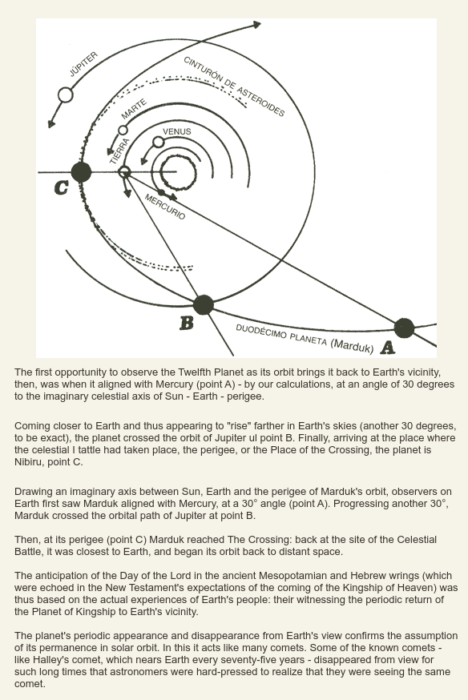
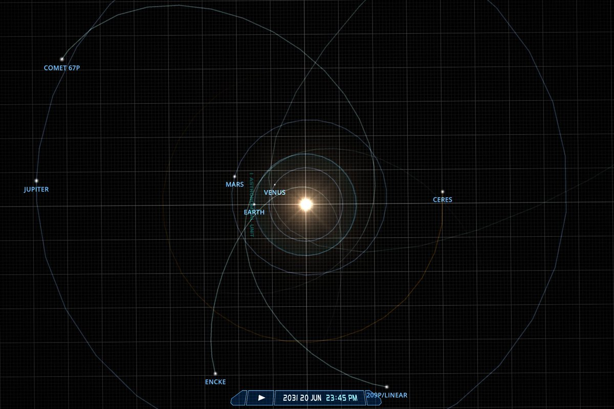

# Zecharia Sitchin

The Earth Chronicles Index

Book 4: The Lost Realms
- Chapter 7: Montesinos, ancient Peruvian timeline
- Chapter 12: Nibiru, Anki, Annunaki

## In The Twelfth Planet, Sitchin...

In The Twelfth Planet, Sitchin illustrates his interpretation of the Sumerian description of the planetary positions at the time of the deluge. There will be a remarkably similar alignment of Jupiter, Mars, Earth, Venus and 2P/Encke [Marduk?] in June 2031, one year after the… https://t.co/z2zxM9gHOz

