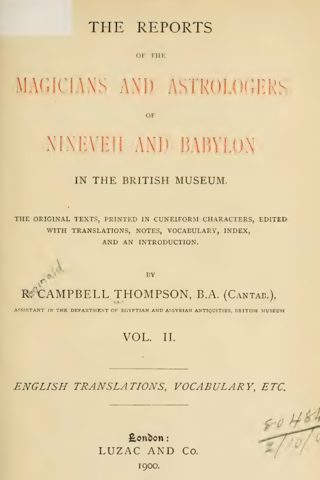
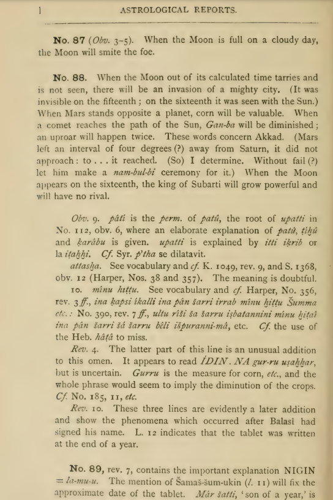

# Thompson

## "When a comet reaches the...

"When a comet reaches the path of the Sun, Gan-ba will be diminished; an uproar will happen twice." - R. C. Thompson (The Reports of the Magicians and Astrologers of Nineveh and Babylon), 1900 [1] This is one of the rare instances where a double event is explicitly mentioned. In… https://t.co/NKtCf2Pa3J https://t.co/sJVn4Zk4dE

