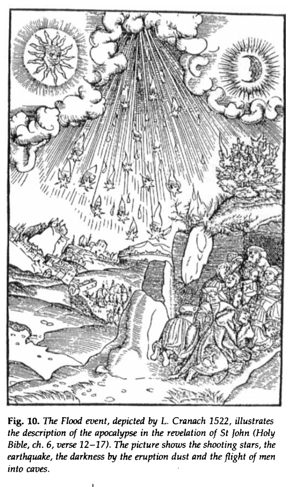

# Tollmann

Author of the Tollmann bolide hypothesis - comet impact around 7400 BC.

"Tollmann's bolide hypothesis is a hypothesis presented by Austrian palaeontologist Edith Kristan-Tollmann and geologist Alexander Tollmann in 1994.[1] The hypothesis postulates that one or several bolides (asteroids or comets) struck the Earth around 7640 ± 200 years BCE, and a much smaller one approximately 3150 ± 200 BCE. The hypothesis tries to explain early Holocene extinctions and possibly legends of the Universal Deluge. The claimed evidence for the event includes stratigraphic studies of tektites,[2][3][4] dendrochronology, and ice cores (from Camp Century, Greenland) containing hydrochloric acid and sulfuric acid (indicating an energetic ocean strike) as well as nitric acids (caused by extreme heating of air)."

https://en.wikipedia.org/wiki/Tollmann%27s_bolide_hypothesis

The youngest big impact on Earth deduced from geological and historical evidence

https://en.wikipedia.org/wiki/Tollmann%27s_bolide_hypothesis#cite_note-Kristan-Tollmann_Tollman_1994-1

A good chunk of it is recounting cataclysm myths. He pieces together a lot of different information, I think it's key to select out what can specifically be dated to 7400 BC.

## Decent ChatGPT Summary

1. Tektite Fields
   - **Victoria, Southern Australia**: Tektites (impact-generated glass) found in Victoria are dated to just under 10,000 years ago, corresponding to this period.
   - **Vietnam**: Tektites found in Vietnam, dated to the oldest Holocene terraces, approximately 10,000 years ago.
   - **Port Campbell, South Australia**: Tektites from Port Campbell have been radiocarbon dated to around **9520 ± 200 YBP**.

2. Continental Impact at Köfels, Austria
   - **Köfels event**: Located in the Ötz valley of Tyrol, Austria, this impact event has been dated using radiocarbon methods to around **9440 ± 150 YBP**, fitting within the 7600-7200 BC range.

3. Greenland Ice Core Acid Fallout
   - **Camp Century Ice Core**: An acid peak in the ice core from Greenland is dated to **9630 ± 170 YBP**. This acid fallout is the highest recorded in the post-glacial period and is attributed to the Flood impact.

4. Dendrochronological Evidence
   - **German Tree-Ring Data**: A notable peak in radiocarbon (¹⁴C) levels around **9545 YBP** has been observed, which corresponds to the proposed Flood event. This spike suggests an increase in atmospheric ¹⁴C production due to the impact.

5. Mammoth Extinction Evidence
   - **Siberian Mammoth**: The most recent mammoth found along the Yuribey River in Siberia has been radiocarbon dated to **9600 ± 300 YBP**, potentially linking the impact event with the extinction of these and other megafauna species.

## Quotes

The most important evidence is provided by the age of the tektites, which are found strewn along the continuation of the flight path to the northwest beyond the impact sites. The tektites in South Australia around Port Campbell (Campbellites) (Fig. 4) have, since 1938, been dated by stratigraphical methods as Lower Holocene, i.e., around 10,000 years old (Fenner, 1959; Baker, 1965; Johnson, 1965). In response to critical voices, Gill (1970, p. 1001) revised the position of these tektites by conducting extremely careful excavations and confirmed the age of the non-reworked tektites through the 14C dating of the accompanying wood, which was around 10,000 years old.

Thirty years ago, Sues dated a sample from the trunk (No. W-95) by the radiocarbon method at 8780 ± 200 years. After modern correction, in light of the 8% higher 14C values now accepted, we arrive at an age of 9520 ± 200 years BP (cf. A. and E. Tollmann, 1989, p. 96).

An analogous hint at the date of this great event is also provided by investigations of the Greenland ice cap, performed through deep drilling (Hammer et al., 1980). The annual stratification in the Camp Century borehole in northwest Greenland demonstrated that the maximum fallout of acids from the entire 9890-year ice core occurred at 9630 ± 170 years BP, surpassing all other peaks of acid from volcanic activity (Fig. 6). The marine impacts may have also produced large quantities of acids, not only hydrochloric and sulfuric acids from the ocean water but particularly nitric acid from the interaction of nitrogen, oxygen, and water vapor in the atmosphere.

We would expect a rapid increase in atmospheric 14C due to the Flood impact, which would be recorded in the wood of trees alive at that time. In 1990, the German botanists Kromer and Becker announced that they had not only extended dendrochronological knowledge by investigating German subfossil oaks back to the year 9920 BP but had also measured the amount of radiocarbon in the rings of these trees over time. According to the points on their 14C curve, we find an exceptional peak around the year 9545 BP (Fig. 7). We are convinced that this peak indicates the Flood event, and we expect, furthermore, that a detailed examination of the tree rings from that time might reveal the exact year of the impact.

Finally, we should not forget that recent 14C measurements of well-preserved tissue from the youngest hitherto discovered Siberian mammoth from the Yuribey River indicated an age of 9600 ± 300 years BP (Dubrovo, 1990, p. 4). Therefore, the long-discounted opinion of Cuvier that the mammoth was extinguished as a species by a worldwide catastrophe followed by a long and strong winter — according to the Edda (R. Derolez, 1976, p. 186), it lasted three years after the Flood — may even be rehabilitated. Such long winters would have been a death sentence for the mammoths.

Wildfire is also recorded as blowing the great rivers out of their beds, as the oral histories of the Indians of California and the traditions in the Near East around the Euphrates record. The Aborigines in southern Australia gave an account of the horrible heat descending from a red-hot sky. The heat was so extreme that people could not endure it, and the men killed their children and wives, and finally themselves (Walk, 1931, p. 76).

During this semi-permanent night, the temperature dropped very quickly. Therefore, according to the myths in elevated regions (such as Iran) and in high geographic latitudes (Edda, traditions of the Yámana in Tierra del Fuego), the rainfall soon transformed into snowfall. The impact winter continued in the regions mentioned for the next three years (Edda; Derolez, 1976, p. 286).

## A few illustrations from the...

A few illustrations from the Tollman paper. https://t.co/w4b5JwtkQK https://t.co/oDx8FGIHlj

