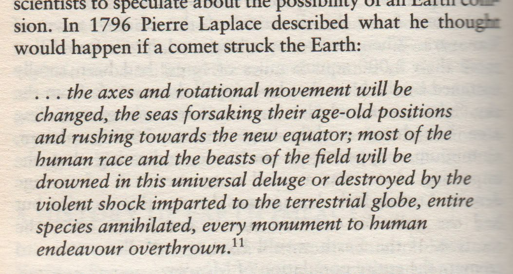

# Uriel's Machine

Uriel's Machine is dense. Every page contains gems.

https://annas-archive.org/md5/3a6852245dd6f4f84e095532cb22cd58

See `uriel1.pdf` for another short excerpt.

Uriel looks into Enoch quite a bit.

## Quotes

### Noah's ark

According to the P tradition, the ark was 300 × 300 × 30 cubits and consisted of three storeys; it also states that the landing point of the ark after the waters subsided was Mount Ararat, in Urartu, which is now known as Armenia. This extremely mountainous country, to the east of Turkey, has an average elevation of nearly 1800 metres and Mount Ararat is, at its highest point, more than four kilometres above sea level. If this description is correct, the ark could only conceivably have been carried to such an elevation by the tsunami wave that was generated by the impact in the Indian Ocean (see Figure 4, here). It would have travelled up the Persian Gulf and North-westwards across the low-lying land of Mesopotamia. If we assume for the moment that there is some truth in this story, it suggests that the ark met the impact wave high up on the Zagros Mountains above the land later to be known as Sumer, and was carried in a straight line until the wave lost its power. We had wondered how anyone could launch a ship into an oncoming tsunami wave, but it could be possible if the wave had travelled over sufficient land to breakdown into a chaotic swirl. If the vessel had been built on a high mountain like this, the rising sea water might be moving vertically upwards, rather than rushing forward like a wall. It is therefore possible that a launch could be achieved in such circumstances, without the vessel necessarily being dashed to matchwood. To sum up, then, the height of the land and its alignment with the wave epicentre and the claimed final resting point of the ark do make sense.

### Flood mapping - carried to specific mountains

Note: Greek flood myth of Deucalion also mentions specific mountains, as does Korea's Dangun myth.

The Indians of Oregon tell a story that the survivors of the Flood, surviving in a boat, came to rest on top of Mount Jefferson – the state’s second highest peak. They believe that all of their tribe alive today descend from these survivors.

In northern California, there is an old tradition telling of animals that were chased by the rising waters to the very top of Mount Shasta which stands at 14,162 feet (over 2.5 miles) above sea level. It says these animals are the ancestors of all animals in the world.

According to the P tradition, the ark was 300 × 300 × 30 cubits and consisted of three storeys; it also states that the landing point of the ark after the waters subsided was Mount Ararat, in Urartu, which is now known as Armenia. This extremely mountainous country, to the east of Turkey, has an average elevation of nearly 1800 metres and Mount Ararat is, at its highest point, more than four kilometres above sea level.

### 3150 BC Mediterranean Comet?

We had already found, from geological and magnetostratigraphical evidence, that there have been at least two cometary impacts within the last 10,000 years. The first major impact had caused world-wide tidal waves and swamped the British Isles in 7640 BC. But we had also found evidence of a smaller impact (discussed in Chapter Three), confirmed during a conversation with Professor Liritzis of Rhodes University, which was localized to the Mediterranean region around 3150 BC.

(I found a paper of Liritzis, which is in his LITERATURE folder, but no specific mention of a 3150 BC Mediterranean comet impact).

### Robert Bauval

Robert’s reply was slow and deliberate. ‘The calibration graph generally shows the very smooth wobble which is to be expected from the precession of the magnetic generator. However, in the last 10,000 years there have been two exceptions when the direction of the magnetic field has changed abruptly and in a manner which suggests an outside impulse. There is a clear perturbation at around 3150 BC, which probably means a cometary impact, but there is a significantly larger one around 7000 BC. [54]

### Comet causing electric current

"‘Do you see the point?’ Robert asked without pausing, before he continued. ‘The heat generated by the movement of such a large object at high speed through the atmosphere must cause a plume of intense electro magnetic radiation. This will ionize the air and push those ions along at enormous speeds, creating a magneto-hydrodynamic shock wave which would cause an enormous plasma tail.’ As a non-physicist, Chris tried to translate this scientific jargon into lay-speak. ‘Are you telling me the friction of an incoming comet with the atmosphere generates a powerful electric current?’ he asked."
