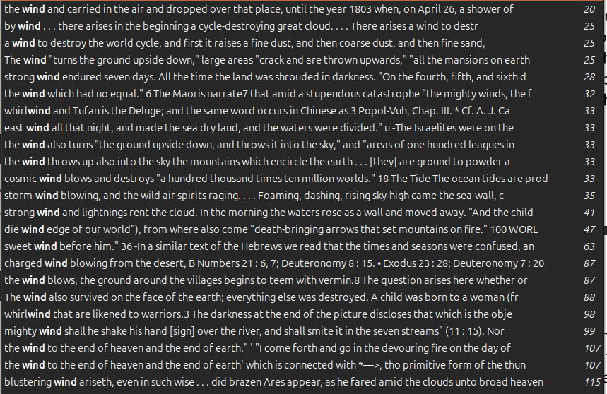

# Velikovsky

Worlds in Collision, Earth in Upheaval

Earth in Upheaval seems more scientific, whereas Worlds in Collision more a compilation of cataclysm accounts.

## Page markers

Worlds in Collision
- Table of Contents: PDF page 21
- add 20 pages to page numbers when navigating the pdf

Earth in Upheaval
- Table of Contents: PDF page 27

## WIC Quotes

This book is an absolute goldmine.

Notable chapter contents:
- p1 venus:
	- ch 3: hurricanes
	- ch 4: volcanoes, earthquakes, yahou
	- **ch 5: sun changing trajectory**
	- ch 6: earth becoming dark
	- **ch 7: comets, solar fire, floods**, Deucalion and Ogyges
	- ch 8: the 52 year period
- p2 mars:
	- ch 7:
	- ch 8:

### p1 ch 4:

pg 100: emperor yahou account

pg 103: "Thereupon Yaou [Yahou] commanded He and Ho, in accordance with the wide heavens, to calculate and movements and appearances of the sun, the moon, the reverent delineate the stars, and the zodiacal spaces; and to deliver respectfully the seasons to the people." The necessity, soon after the flood, of finding anew the four direc- tions and learning anew the movements of the sun and the moon, of delineating the zodiacal signs, of compiling the calendar, of inform- ing the population of China of the sequence of the seasons, creates the impression that during the catastrophe the orbit of the earth and the year, the inclination of the axis and the seasons, the orbit of the moon and the month, changed. We are not told what caused the cataclysm, but it is written in ancient annals that during the reign of Yahou “a brilliant star issued from the constellation Yin.”

pg 103: The story of the deluge of Noah has its parallel in a Chinese tradition
about a universal flood in prehistoric times, in the days of Fo-hi, who
alone of all the country was saved.

The flood of Yahou is sometimes regarded as simultaneous with the flood of Ogyges.

The flood of Ogyges did not occur in the third millennium, but in
the middle of the second millennium before this era. In the section entitled “The Floods of Deucalion and Ogyges,” the synchronism of these devastations with the catastrophes of the days of Moses and Joshua will be demonstrated and supported by ancient and chrono- logical sources.

When we summarize what has been told about the time of Yahou, we have the following data: the sun did not set for a number of days,
104
the forests were set on fire, vermin filled the country, a high wave
reaching the sky poured over the face of the land and swept water
over the mountain peaks and filled the valleys for many years; in the
days of Yahou the four quarters of the heaven were established
anew, and observations of the duration of the year and month and
of the order of the seasons were made. The history of China in the
period before this catastrophe is quite obliterated.

### p1 Chapter 5: Sun Changing Trajectory

**Page 105:** Accounts from Egypt describe the sun changing its trajectory.

**Page 108:** A depiction from Egypt shows a "reverse" constellation.

**Page 116: Exodus** - The Talmud and other ancient rabbinical sources speak of significant disturbances in the sun’s movement during the time of the Exodus, the Passage of the Sea, and the Lawgiving. In old Midrashim, it is repeatedly narrated that four times the sun was forced out of its course in the few weeks between the day of the Exodus and the day of the Lawgiving.

**Page 117:** The Midrashim describe a disturbance in the sun’s movement on the day of the Passage: the sun did not proceed on its course. According to the Psalms (76:8), “the earth feared and was still.” It is possible that Amos (8:8-9) is recalling this event when he mentions the “flood of Egypt,” at the time “the earth was cast out of the sea, and dry land was swallowed by the sea,” and “the sun was brought down at noon,” although, as suggested later, Amos might have referred to a more recent cosmic catastrophe.

**Page 119: Deucalion:** The cosmological allegory of the Greeks has Zeus, rushing on his way to engage Typhon in combat, steal Europa (Erev, the evening land) and carry her to the west. Arabia (also Erev) kept its name, though it lies to the east of the centers of civilization—Egypt, Palestine, Greece. Eusebius, one of the Fathers of the Church, assigned the Zeus-Europa episode to the time of Moses and the Deucalion Flood, and Augustine wrote that Europa was carried by the king of Crete to his island in the west, “betwixt the departure of Israel out of Egypt and the death of Joshua.”

**Page 122: Exodus:** With the end of the Middle Kingdom in Egypt, when the Israelites left that country, the old order of seasons came to an end and a new world age began. The Fourth Book of Ezra, which borrows from some earlier sources, refers to the “end of the seasons” in these words: “I sent him [Moses] and led my people out of Egypt, and brought them to Mount Sinai, and held him by me for many days. I told him many wondrous things, showed him the secrets of the times, declared to him the end of the seasons.”

pg 122: The American sources, which speak of a world colored red, of a
rain of
of
fire,
world conflagration,
new rising mountains, of
of
frightening portents in the sky, of a twenty-five-year gloom

123: Length of year changed from 365 to 360 days after Exodus? Related to Mayan calendar adjustment around 650 BC: "With the fall of the Middle Kingdom and the Exodus, one of the
great world ages came to its end.
The four quarters of the world
were displaced, and neither the orbit nor the poles nor, probably,
the direction of rotation remained the same. The calendar had to be
adjusted anew. The astronomical values of the year and the day could
not be the same before and after an upheaval in which, as the quoted
Papyrus Anastasi IV says, the months were reversed and “the hours
disordered.”"

124: "The fact I hope to be able to establish is that from the fifteenth
century to the eighth century before the present era the astronomical
year was equal to 360 days; neither before the fifteenth century, nor
after the eighth century was the year of this length. In a later chapter
of this work extensive material will be presented to demonstrate this
point."

### p1 chapter 6 - volcanic ash (good chapter)

If the eruption of a single volcano can darken the atmosphere over
the entire globe, a simultaneous and prolonged eruption of thou-
sands of volcanoes would blacken the sky. And if the dust of the
comet of —44 had a darkening effect, contact of the earth with a great
cinder-trailing comet of the fifteenth century before this era could
likewise cause the blackening of the sky. As this comet activated all
the volcanoes and created
new ones, the cumulative action of the
eruptions and of the comet’s dust must have saturated the atmosphere
with floating particles.

pg 127: "“Following the cataclysm caused by the waters, the author of the Codex Chimalpopoca, in his history of the suns, shows us terrifying
celestial
phenomena, twice followed by darkness that covered the
face of the earth, in one instance for a period of twenty-five years.”
“This fact is mentioned in the Codex Chimalpopoca and in most of
the traditions of Mexico.”"

"Gomara, the Spaniard who came to the Western Hemisphere in
the middle of the sixteenth century, shortly after the conquest,
wrote: 8 “After the destruction of the fourth sun, the world plunged
in darkness during the space of twenty-five years.
Amid this pro-
found obscurity, ten years before the appearance of the fifth sun,
mankind was regenerated."

The “shadow of death” is related to the time of the wanderings in
the desert after the Exodus from Egypt. The sinister meaning of the
words “shadow of death” corresponds with the description of the
Ermitage Papyrus: “None can live when the sun is veiled by clouds.”
At intervals the earth was lighted by conflagrations in the desert. [129]

130: "Nihongi, a chronicle of Japan from the earliest period, refers to a
time when there was “continuous darkness” and “no difference of day
and night.” It describes in the name of the Emperor Kami Yamato an
ancient time when “the world was given over to widespread desola-tion; it was an age of darkness and disorder. In this gloom Hiko-ho-
no-ninigi-no-Mikoto fostered justice, and so governed this western
border.”"

He goes on to discuss ambrosia, bread of the gods, that seems to be some sort of sweet carbon based substance that accumulated in the wake of the disaster.

134: “When the dew fell upon the camp in the night, the manna fell
upon it.” It was like “the hoar frost on the ground.” It had the shape
of coriander seed, the yellowish color of bdellium, and an oily taste
like honeycomb. It was called
“com of heaven” and it was ground
between stones and baked in pans 1 The manna fell from the clouds 2

### p1 ch7 quotes

Joshua

141: "THE HOT HAILSTONES which, at Moses’ intercession, had re-
mained suspended in the air when they were about to fall upon
the Egyptians, were now cast down upon the Canaanites.” 1 These
words mean that a part of the meteorites of the cometary train of
the days of Exodus remained in the celestial sphere for about fifty
years, falling in the days of Joshua, in the valley of Beth-horon, on
the same forenoon when the sun and the moon stood still for the
length of a full day."

pg 143: Many authors have dealt with the story of Phaethon; the best known version is a creation of the Latin poet Ovid. The chariot of the sun, driven by Phaethon, moved “no longer in the same course as before.”

“The earth bursts into flame, the highest parts first, and splits into deep cracks, and its moisture is all dried up. The meadows are burned to white ashes; the trees are consumed, green leaves and all, and the ripe grain furnishes fuel for its own destruction. . . . Great cities perish with their walls, and the vast conflagration reduces whole nations to ashes.”

“Then also Libya became a desert, for the heat dried up her mois- ture. . . . The Don’s waters steam; Babylonian Euphrates burns; the Ganges, Phasis, Danube, Alpheus boil; Spercheos’ banks are aflame. The golden sands of Tagus melt in the intense heat, and the swans . . . are scorched. . . . The Nile fled in terror to the ends of the earth . . . the seven mouths lie empty, filled with dust; seven broad channels, all without a stream. The same mischance dries up the Thracian rivers, Hebrus and Strymon; also the rivers of the west, the Rhine, Rhone, Po and the Tiber. . . . Great cracks yawn every- where. . . . Even the sea shrinks up, and what was but now a great watery expanse is a dry plain of sand. The mountains, which the deep sea had covered before, spring forth, and increase the numbers of the scattered Cyclades.”

pg 145: There have been and there will be many and divers destructions of mankind, of which the greatest are by fire and water, and lesser ones by countless other means. For in truth the story that is told in your country as well as ours, how once upon a time Phaethon, son of Helios, yoked his father’s chariot, and, because he was unable drive it along the course taken by his father, burnt up all that was upon the earth and himself perished by a thunderbolt-that story,
it is told, has the fashion of a legend, but the truth of it lies in occurrence of a shifting of the bodies in the heavens which move around the earth, and a destruction of the things on the earth fierce fire, which recurs at long intervals.”

147, a spot where Velikovsky seems incorrect: We do not know of any vestiges of human culture, aside from that of the Neolithic age, nor of any navigating nation, 9,000 years before Solon... hatever the source of the error, the most probable date of the sinking of Atlantis would be in the middle of the second millen- nium, 900 years before Solon,

148: The history of Greece knows two great natural catastrophes: the floods of Deucalion and of Ogyges. One of them, usually that of Deucalion, is described by Greek authors as having been simultane- ous with the conflagration of Phaethon. 

149: Eusebius placed the Flood of Deucalion and the conflagration of Phaethon in the fifty-second year of Moses’ life. Augustine also synchronizedtheFloodofDeucalionwiththetimeofMoses; he assumed that the Flood of Ogyges took place earlier.

A chronologist of the seventh century (Isidore, bishop of Seville) dated the Flood of Deucalion in the time of Moses; chronologists of the seventeenth century likewise calculated that the Flood of Deu- calion took place in the time of Moses, close to but not simultaneous
7
with the Exodus.

150: Interesting theory from Velikovsky about why Ogyges must have come after Deucalion. And that Ogyges occurred in the days of Joshua, around 1500 BC (I presume).

Apparently, the truth is with those who placed the catastrophe of
Deucalion in the days of Exodus; but those
who reckoned that
Ogyges was a contemporary of Moses were also correct, except that
Moses did not live until the Flood of Ogyges— it took place in the
days of Joshua.

pg 152 The assertion of Solinus, the author of Polyhistor, that the flood
of Ogyges was followed by a night of nine months’ duration does
not necessarily signify a confusion with the darkness that ensued
after the cataclysm of the Exodus;

### p1 ch8 - the fifty two year period

The upheaval that took place in the days of Joshua and
Agog, the deluge that occurred in the days of Ogyges, the metamor-
phosis of Venus in the days of Ogyges, the star Venus which ap-
peared in the sky of Mexico after a protracted night and a great
catastrophe— all these occurrences are related.

Chinese chronicles record that “a brilliant star appeared
in the
days of Yahu [Yahou]. [159]

## References to wind in WIC

# TODO

- flood records
	- china 2300 bc flood
- bible passages relating to ECDO