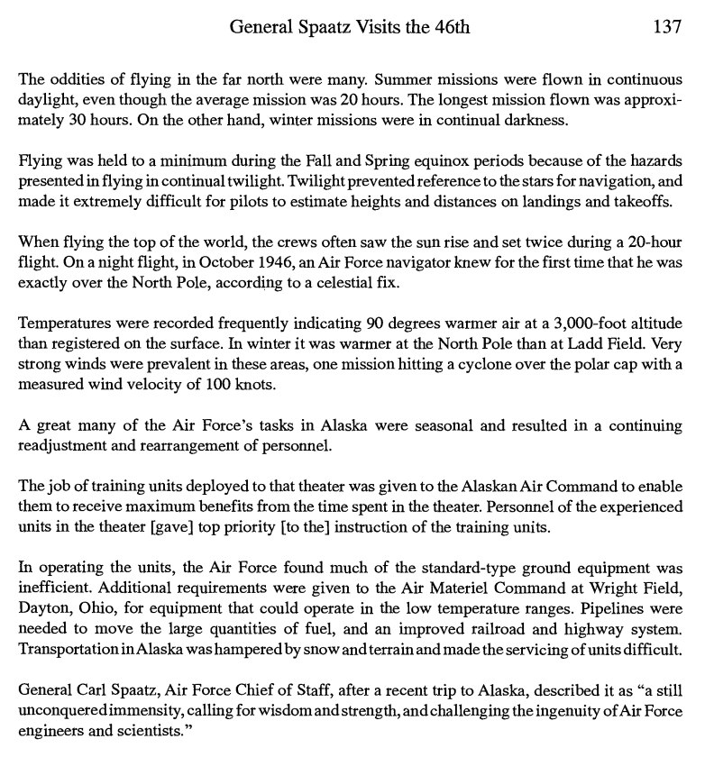

# Ken White, World in Peril (1994)

“At one of the scientific meetings that Major White attended in the Pentagon in early 1948, the scientists discussed the advisability of alerting the public to the pending polar-flip phenomenon. None of the scientists would agree to withhold the information from the public; but, on the other hand, neither could they agree on how to release it. The knowledge of this phenomenon, some felt, could in itself destroy the moral fiber of society…

Although the next polar flip could commence at any moment, until our governments and scientific institutions begin to seriously study this phenomenon and take the appropriate actions to prepare for global change; it appears that prayer is the only thing we have going for us.”

– Ken White, World in Peril (1994)

https://nobulart.com/the-flip-of-the-earth/

## Timemark

I have been reviewing "World in Peril" again and have made a few fresh observations. One was here at about the 4:28:00 mark. They note that the air temp at the north pole was consistently 90 degrees warmer than surface temps? That seems rather bizarre.

https://youtu.be/ksDEYNR-RlU?si=IIzPNeNBqXRH5rHu&t=16112

Found it in the book. That is an interesting observation. I imagine that this has to do with the Birkeland currents which connect at the poles, and which are responsible for the aurora. The aurora are actually pretty hot (200-1100 degrees centigrade), but the plasma is very dispersed so they don't heat the upper atmosphere to this temperature, but will certainly raise it.

https://cdnsciencepub.com/doi/abs/10.1139/p69-242

## "Just as a toy top...

"Just as a toy top or a gyroscope will occasionally wobble under certain circumstances, apparently the earth too has intermittently “toppled” when its poles sought to converge, causing its crust to make dramatic shifts off the polar axis." Ken White (1994) https://t.co/BCrSN0Chc3