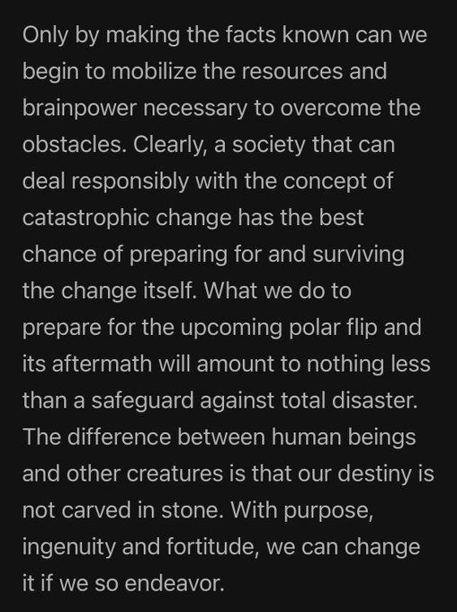

# Ken White, World in Peril (1994)

“At one of the scientific meetings that Major White attended in the Pentagon in early 1948, the scientists discussed the advisability of alerting the public to the pending polar-flip phenomenon. None of the scientists would agree to withhold the information from the public; but, on the other hand, neither could they agree on how to release it. The knowledge of this phenomenon, some felt, could in itself destroy the moral fiber of society…

Although the next polar flip could commence at any moment, until our governments and scientific institutions begin to seriously study this phenomenon and take the appropriate actions to prepare for global change; it appears that prayer is the only thing we have going for us.”

– Ken White, World in Peril (1994)

https://nobulart.com/the-flip-of-the-earth/

