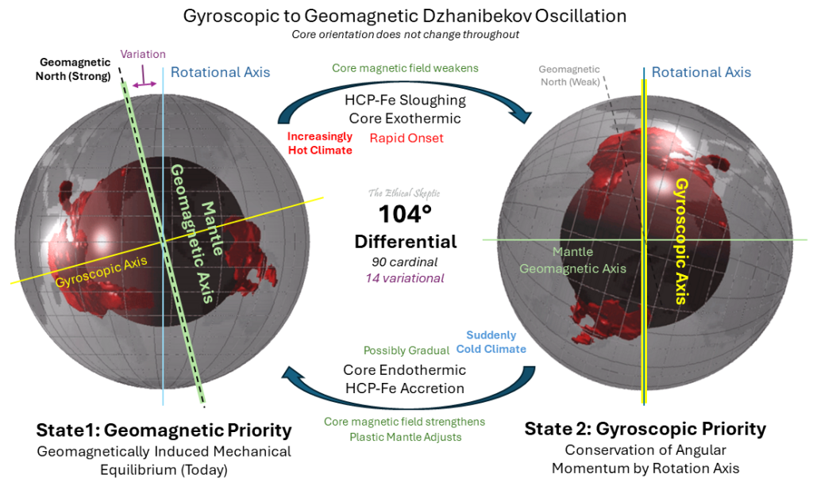

# Ethical Skeptic

Ethical Skeptic is the author of the [original ECDO thesis](https://theethicalskeptic.com/2024/05/23/master-exothermic-core-mantle-decoupling-dzhanibekov-oscillation-theory/).

Notably, he breaks his thesis down into 3 parts:
- The Earth's warming being caused by the core exerting heat into the mantle
- What the Pyramid of Giza tells us
- Dzhanibekov oscillation

The key point to understand here is that this thesis is not a random dart throw but was a progressive process of figuring things out, as outlined in his three theses.

I consider recreating his proofs to be of the highest priority. That work belongs in folder `FULL-THESIS-BREAKDOWN`.

## Contents

- `src-pdfs`: Copies of Ethical Skeptic's theses.
- `theory-part-[1-3]`: My personal short summaries of Ethical Skeptic's theses.
