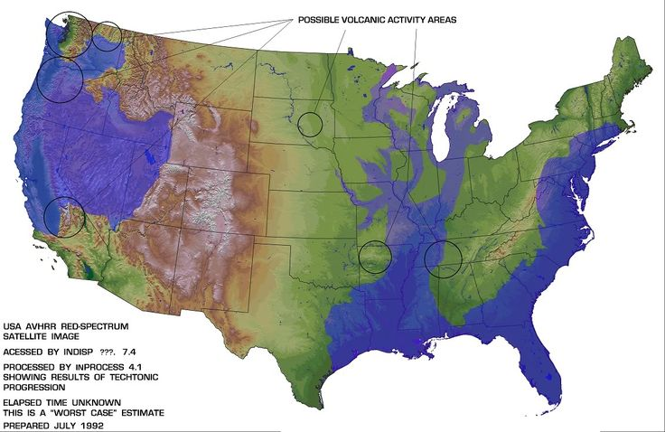

# Edgar Cayce

Absolutely need to look into his work on a pole shift, flooding, earthquakes, and volcanos.

Blog post about him:
- https://www.lovetoknow.com/life/lifestyle/edgar-cayce-maps-his-prophecies-earth-explained

## Flood Map

## Contents

- `articles`: Copies of articles about Edgar Cayce.