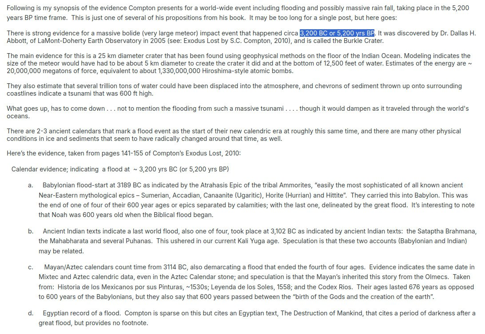

# Compton

What follows is a [forum post](https://www.mormondialogue.org/topic/74277-global-flood-literalism-rides-again/page/5/) detailing an Internet anon's synopsis of the work of S. C. Compton in his book "Exodus Lost: An Inquiry into the Genesis of Civilization". Full forum post text below.

## Forum post

Following is my synopsis of the evidence Compton presents for a world-wide event including flooding and possibly massive rain fall, taking place in the 5,200 years BP time frame.  This is just one of several of his propositions from his book.  It may be too long for a single post, but here goes:

There is strong evidence for a massive bolide (very large meteor) impact event that happened circa 3,200 BC or 5,200 yrs BP. It was discovered by Dr. Dallas H. Abbott, of LaMont-Doherty Earth Observatory in 2005 (see: Exodus Lost by S.C. Compton, 2010), and is called the Burkle Crater.

The main evidence for this is a 25 km diameter crater that has been found using geophysical methods on the floor of the Indian Ocean. Modeling indicates the size of the meteor would have had to be about 5 km diameter to create the crater it did and at the bottom of 12,500 feet of water. Estimates of the energy are ~ 20,000,000 megatons of force, equivalent to about 1,330,000,000 Hiroshima-style atomic bombs.

They also estimate that several trillion tons of water could have been displaced into the atmosphere, and chevrons of sediment thrown up onto surrounding coastlines indicate a tsunami that was 600 ft high.

What goes up, has to come down . . . not to mention the flooding from such a massive tsunami . . . . though it would dampen as it traveled through the world's oceans.

There are 2-3 ancient calendars that mark a flood event as the start of their new calendric era at roughly this same time, and there are many other physical conditions in ice and sediments that seem to have radically changed around that time, as well.

Here’s the evidence, taken from pages 141-155 of Compton’s Exodus Lost, 2010:

### Calendar evidence; indicating  a flood at  ~ 3,200 yrs BC (or 5,200 yrs BP) 

a. Babylonian flood-start at 3189 BC as indicated by the Atrahasis Epic of the tribal Ammorites, “easily the most sophisticated of all known ancient Near-Eastern mythological epics – Sumerian, Accadian, Canaanite (Ugaritic), Horite (Hurrian) and Hittite”.  They carried this into Babylon. This was the end of one of four of their 600 year ages or epics separated by calamities; with the last one, delineated by the great flood.  It’s interesting to note that Noah was 600 years old when the Biblical flood began.

b. Ancient Indian texts indicate a last world flood, also one of four, took place at 3,102 BC as indicated by ancient Indian texts:  the Sataptha Brahmana, the Mahabharata and several Puhanas.  This ushered in our current Kali Yuga age.  Speculation is that these two accounts (Babylonian and Indian) may be related.

c. Mayan/Aztec calendars count time from 3114 BC, also demarcating a flood that ended the fourth of four ages.  Evidence indicates the same date in Mixtec and Aztec calendric data, even in the Aztec Calendar stone; and speculation is that the Mayan’s inherited this story from the Olmecs.  Taken from:  Historia de los Mexicanos por sus Pinturas, ~1530s; Leyenda de los Soles, 1558; and the Codex Rios.  Their ages lasted 676 years as opposed to 600 years of the Babylonians, but they also say that 600 years passed between the “birth of the Gods and the creation of the earth”.

d. Egyptian record of a flood.  Compton is sparse on this but cites an Egyptian text, The Destruction of Mankind, that cites a period of darkness after a great flood, but provides no footnote.

Commentary on the discrepancies of these dates:  The Babylonians only give a start date for the flood:  3189 BC. But both the Indian and Mayan/Aztecan dates signify not the start of the flood, but the start of a new age with a new Sun God appearing after a period of darkness following the flood.  A Mayan pot exhibits an interim date of 3149 BC as the time when the old sun god was defeated after the flood, but a new one had not yet been installed (3114 BC).

Similarly, as indicated above, an Egyptian text (The Destruction of Mankind), “similarly describes a

period of time following the flood when the world was in darkness until a god could be found to become the new sun.

One of the characteristics of a large meteor (bolide) hitting the earth is a lot of dust (and in the case of the Burkle crater, immense amounts of water and water vapor) being sent into the atmosphere largely obscuring or dampening sunlight for several years.

### Pysical evidence of a major planetary event happening in the 3,200 yrs BC (or 5,200 yrs BP) time frame.  Footnotes for these claims can be found in the book.

a. Major drop in temperature at the ~3,200 yrs BC mark, as indicated by:

1) Oxygen 18 (δO18) ratio measurements in ice caps.

2) δO18 ratios from stalagmites from cave formations

3) Temperature sensitive chemicals in phytoplankton in sediments drilled from sea floor.

4) Species of pollen trapped in ancient sediment layers.

b. Monumental surge in precipitation for this time period, as indicated by:

1) Sudden dramatic surge in methane at 3,200 yrs BC as found in air bubbles trapped in Greenland ice cap.  Methane correlates w/amount of wetlands.

2) Pollen profiles indicate surge in precipitation at this time, as well.

3) High precision records of water levels in ancient lakes increase at this time.

“In many of these paleoclimate records, this event is the most extreme increase in precipitation and drop in temperature in the more than 10,000 years since the end of the last ice age” and “was also nearly instantaneous.”

c.  Flash freeze events:

1) Discovery in 2003 by the Byrd Polar Research Center of well-preserved but frozen, soft-bodied wetland plants still rooted in ancient earth, at the base of the Quelccaya ice cap situated at 18,600 foot elevation in the Peruvian Andes.  RC-14 dates of the plants yielded a date of 3,188 ± 45 yrs BC, precisely the Babylonian date for the great flood (3189 BC).

2) “Unweathered tree still standing with its roots firmly planted in the earth” discovered in Washington State at the base of the receding Cascade Glacier and dated to this same time”.

3) 1991 discovery of Ötzi, a human body revealed by a melting glacier in the Italian Alps, which dated to 3225 ± 125 yrs BC.  “The exceptional state of preservation of the Ice-man and of his artifacts requires that he was rapidly entombed at the time of this death and remained so until he was discovered”.  “Thus, the Iceman reveals that at about 5,300-5,050 cal yr BP, a rapid climatic change took place producing a persistent snow cover on previously deglaciated areas . . . . This deterioration in climate marks the beginning of Neoglaciation in the Alps, which induced a glacier expansion.”

4) Entire town found buried by a mudslide in the Czech Republic at this exact time.  Excavation revealed a ground gradient so gradual that it would have taken extreme precipitation to mobilize the earth.

d. Volcanic-like effects also induced by large meteors:

1) “Dust-veil” events:  largest ever recorded according to tree rings, began in 3,190 yr BC range.  “In some places, including Mesoamerica, vast forests completely died.  In England, the oldest known trees of two regional oak chronologies all began their lives at this time”.

2) Primary way dust-veil events affect climate is through the release of sulfur into the stratosphere, where it combines w/water to produce sulfuric acid.  Largest spike in acid levels found in the Greenland ice sheet in at least the last 9,000 years occurred in 3150 ± 90 yrs BC, but there are no correlated volcanic eruptions associated with this spike.

3) Largest sulfate spike in the Greenland ice sheet began ~3,200 yrs BC.  Much larger than sulfate spikes associated w/known volcanic eruptions.

4) In 2005, a new technique (combining synchrotron radiation, XRAY microfluorescence and absorption spectroscopy) analyzed bands in Alpine stalagmites, and found a band containing highly concentrated sulfur dated at 3150 ± 130 yrs BC.

Commentary on the sulfur/sulfuric/sulfuric acid concentrations at this date and time:  the fact that the intense sulfur is found in the ice cap is indicative of atmospheric sulfur and not a local anomaly; and the amount is far greater than that produced by any known volcanoes.  The likely source is a very large meteor, where one “300 m across contains five times as much sulfur as the entire modern (well-polluted) atmosphere”.  So the Burkle meteor, at 25 km across, could contains 17 times as much as this.

e. Chevrons consisting of sediments thrown up from deep ocean floor on coastlines surrounding location of the Burkle Crater.

1) Miles long and more than 100 m tall, some covering an area as large as Manhattan.  It would take a tsunami 600 ft tall to produce them.

2) Dee Breger analzed samples of chevron sediment in October, 2006, using “a scanning electron microscope (SEM) and found deep-ocean microfossils (benthic foraminifera) that had been splashed with molten iron, nickel and chrome in proportions consistent with a chondritic meteor”.

Now I haven't thoroughly vetted Compton's sources, but if accurate and in my view, the event 'precipitated' by the Burkle meteor has a high probability of having caused the massive flooding, including the Noahic flood of that time-period.
