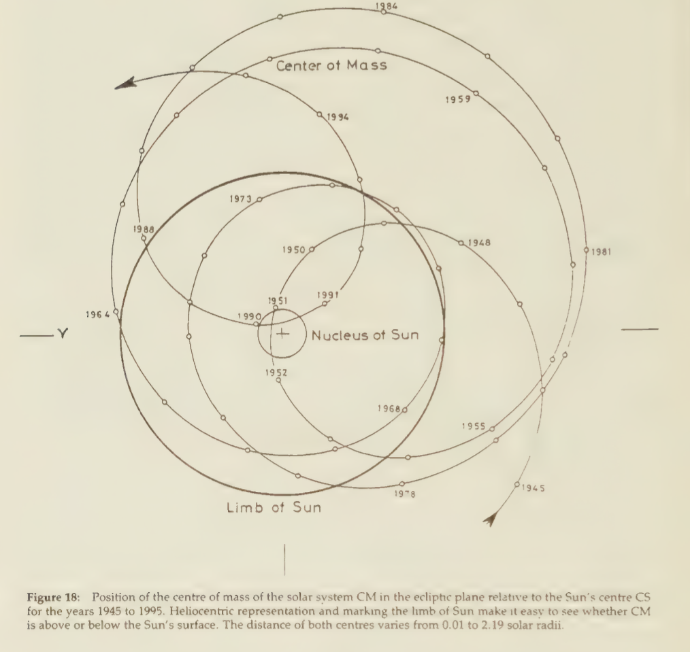

# Theodor Landscheidt

Author of "Sun Earth Man".

There is [a website about him](https://landscheidt.info) which seems to have a lot of material. Archive of his work also [here](http://landscheidt.wordpress.com/).

Hard copies of his work in their respective folders.

## Learning about gas giant grand cycle

Sources recommended:
- Sun Earth Man
- Search Annaś for papers by Theodor Landscheidt, Nicola Scafetta, Geoff Sharp and Carl Smith. Many linked from landscheidt.info

## Sun Earth Man synopsis quotes

Page numbers cited in brackets.

### Ch 2: Example avails ten times more than precept

It has been shown at international conferences of astronomers, geophysicists, and climatologists, but also at astrological research conferences in London, that impulses of the torque (IOT) in the Sun’s irregular oscillations about the invisible centre of mass of the solar system, induced by the giant planets, regulate the incidence of energetic solar eruptions and their terrestial response. Details will be given in a later chapter. Strong impulses of the torque occur when the Sun’s centre, the centre of mass, and Jupiter, the weighty centre of the world of planets, are in line. These heliocentric conjuctions of Jupiter and the centre of mass again are a boundary phenomenon. They mark a zero phase in the Sun’s motion about the centre of mass, in which the torque acting on the Sun reaches zero, changes sign, and shows a more or less sharp increase in the new direction. The Sun changes from approaching the centre of mass to receding from it or vice versa. Just this boundary phenomenon releases instability together with a wealth of new patterns in the Sun’s surface that is followed by corresponding effects in the Earth’s surface region. [13]

Thus, it makes sense that the major instability events... occurred just when the centre of mass remained in or near the Sun's surface for several years. When the Sun approaches the centre of mass (CM), or recedes from it, there is a phase when CM passes through the Sun’s surface. Usually, this is a fast passage, as the line of motion is steeply inclined to the surface. There are rare instances, however, when the inclination is very weak, CM runs nearly parallel with the Sun’s surface, or oscillates about it so that CM remains near the surface for several years. Fixing the epochs of start and end of such periods involves some arbitrariness. [16]

But actually conjunctions and oppositions of the giant planets play a vital part in the Sun’s irregular motion about the centre of mass (CM). The Sun reaches extreme positions relative to CM when traditional constellations are formed by Jupiter, Saturn, Uranus, and Neptune. When Jupiter on one side of the Sun is in opposition to Saturn, Uranus and Neptune on the other side, the Sun’s centre and the centre of mass CM come together, whereas the two centres reach their greatest distance when all of the four giant planets are in conjunction. [28]

### Ch 4: Cycles of solar eruptions

Flares are the most powerful and explosive of all forms of solar eruptions, and the most important in terrestrial effect. Large flares release energy equivalent to the explosion of more than 200 million hydrogen bombs in a few minutes’ time, sufficient to meet mankind’s energy demands for a 100 million years. Momentary temperatures exceed 20 million ° K, which is hotter than in the searing interior of the Sun. Ultraviolet and X-ray radiation increases dramatically and causes multiple geophysical effects in the upper atmosphere. [34]

Research in solar eruptions seems to follow the same type of history as that of sunspots. It took more than 200 years to find out that they form a cycle of 11 years. [41] (Page 43 he mentions that these cycles have variation from 7 to 17 years)

### Ch 5: Planetary control of the Sun's motion about the centre of mass of the solar system

The first process involved are impulses of the torque (IOT) in the Sun’s motion about the centre of mass of the solar system (CM) that were mentioned already. They are induced by special heliocentric constellations of the giant planets Jupiter, Saturn, Uranus, and Neptune. [43]

There is mutual interdependence. While the planets make the Sun oscillate around CM, the Sun induces a still more intricate dance of the planets about the centre of mass of the solar system. [43]

Page 44, nice visual of Sun around CM time-series:

### Ch 6: Planetary regulation of secular and supersecular sunspot cycles

The Sun reaches extreme positions relative to CM when the giant planets form special constellations. The Sun’s centre (CS) and CM come very near to each other when Jupiter on one side of the Sun is in opposition to Saturn, Uranus, and Neptune on the other side, whereas CS and CM reach their greatest distance when all of the giant planets form a-conjunction. Conspicuously, just in 1951, when the Sun’s centre CS was very near CM and the Sun changed from approaching it to receding from it, the secular sunspot cycle of about 80 years reached a maximum. This was no fortuitous fit. Further analysis showed that such phases of spectacular change in the Sun’s orbital motion coincide with relatively strong impulses of the torque (IOT). [45]

Math relationships on page 45 for torque and impulses of the torque (IOT).

When consecutive IOT are taken and smoothed to constitute a new time series, a wave pattern emerges that bears information as to the epochs of extrema in the secular Gleissberg-cycle. It has a mean length of 166 years, but each extremum, whether positive or negative, is correlated to a maximum in the secular sunspot cycle, while minima occur when the curve reaches zero values. The mean interval between consecutive extrema is 83 years and varies within 47 to 118 years. [45]

Above mentioned graph in `0-FULL-THESIS-BREAKDOWN/solar-system`.

The extrema in the secular wave of IOT can be taken to constitute a smoothed supersecular wave with a quasi-period of 391 years. This long wave points to an imminent supersecular sunspot minimum about 2030. There are indications that secular and supersecular sunspot minima are related to variations in climate. Thus a prolonged period of colder climate is about to be initiated by the secular minimum past 1990, will reach its deepest point around the supersecular minimum in 2030, and come to an end about 2070. [48]

### Ch 7: Planetary forcing and flare cycles

Strong impulses of the torque are initiated when the planet Jupiter, the centre of mass CM, and the Sun's centre CS are in line (JU-CM-CS). There are two types of JU-CM-CS events: those that are accompanied by a sharp increase in orbital momentum and centrifugal motion of the Sun away from CM (JU-CM-CSc), and those that coincide with a decrease in orbital momentum and centripetal motion of the Sun toward CM due to prevailing gravitation (JU-CM-CSg). These two different types can have different effects on the Sun and solar-terrestrial interaction. [49]

There is a wealth of papers that try to establish a relation between tidal planets and sunspots. Critical authors stress that all tidal planets, when in conjunction, could only raise a tide of a few millimeters on the Sun. But it should be taken into consideration that the horizontal component of the tidal forces could be of interest, as the Sun’s gravity acceleration is 28 times that of the Earth’s. [49]

Calculations of the relative tidal forces of the planets Mercury to Saturn show that the latter is as negligible as that of Mars. Comparison of the composed vector of the tidal forces of Venus, Earth, and Jupiter, excluding or including Mercury, shows that the vector including Mercury oscillates around the vector of Venus, Earth, and Jupiter. Therefore, only the latter was investigated in its relation to energetic flares marked by X-ray bursts equal to or greater than class X2 (2X2). Figure 21 presents the result. Unexpectedly, no cardinal correlations with the magnitude of the vector emerged. But the change in direction proved to be crucial. The angular acceleration dw/dt = d’g/d¥ of the vector forms a cyclic pattern which shows a strong relation with X-ray bursts observed since 1970. [51]

The complex results show how difficult it would be to predict solar flares and their terrestrial effects without knowledge of the intricate regulation of solar activity by both the giant planets and the tidal planets, the effects of Which are coupled by Jupiter, the main factor in both groups. [52]

### Ch 8: Modulation of the Sun's rotation by planetary configurations

The successful forecast of highly energetic events greater than class X9 in 1982 was directly founded on the JU- CM-CS event in 1982.83. Such constellations are nearly always accompanied by very energetic eruptional activity. They seem to affect such activity via the Sun’s rotation rate. The Sun, rotating on its axis, and the Sun, revolving around CM, could be looked at as coupled oscillators capable of internal resonance resulting in slight positive or negative accelerations in the Sun’s spin. Such accelerations are actually observed. Speeding up or slowing down of the Sun’s rotation rate is liable to influence the Sun’s activity. Slower rotation seems to be linked to enhanced activity and faster rotation to weak activity. [53]

The planet Jupiter that is involved in these constellations plays a dominant role even among the giant planets that regulate the Sun’s oscillations about CM. Jupiter holds 71% of the total mass of the planets and 61% of the total angular momentym of the system, whereas the Sun governs less than 1% of the angular momentum. This seems to be indicative of a case of spin-orbit coupling of the spinning Sun and the Sun revolving about CM, involving transfer of angular momentum from Jupiter to the revolving Sun and eventually to the spinning Sun. With respect to the angular momentum conservation law it makes sense that the observed slowing down in the Sun’s spin coincides with an increase in the Sun’s orbital angular momentum. [53]

This makes allowance for the two types of JU-CM-CS events mentioned already: those that go along with an increase in orbital momentum and resulting centrifugal motion of the Sun (C), and those that initiate a decrease in orbital momentum and centripetal motion due to prevailing gravitation (G). [55]

### Ch 10: Solar System Constellations and Geomagnetic Disturbances

Geomagnetic storms, which are released by energetic solar eruptions, are important geophysical events. Newer results indicate that there is a connection with weather. [61]

### Ch 12: Cosmic Influence on Weather

Figure 30 provides evidence of a strong connection of rainfall over central Europe with JU-CM-CS epochs. [67]

### Ch 13: Pythagorean Harmony

One of the first interdisciplinary approaches to a holistic understanding of our world was that of Pythagoras and his disciples. They created the theory of the functional significance of numbers in the objective world and in music. Their famed dictum “all is number” meant that all existing entities can be ultimately reduced to number relationships that do not only link mathematics to music theory, but also to acoustics, geometry, and astronomy. [72]

### Ch 14: Energy Display in Solar Eruptions “Set to Music"

As the prototypal pattern in Figure 33 presents a synopsis of the most energetic category of solar eruptions recorded for the past 45 years, it corroborates the hypothesis that consonant intervals play an important role with respect to the Sun’s eruptional activity. [76]

### Ch 15: Harmonical Consonances in Solar Cycles Covering Thousands of Years

One of the consequences that can be derived from the energy wave is the forecast of an imminent supersecular sunspot minimum around 2030 A.D. [77]

The smaller numbers underneath point to a connection with the period of the triple conjunction of Jupiter, Saturn, and Uranus, mentioned in the introductory part. This period of 317.7 years, which is related to the Sun’s activity and terrestrial climate in Precambrium, shows a connection with the consonant also intervals investigated here. [79]

### Ch 17: Epilogue

There is one constant in the diversity of motives and their variation in the morphology of the Julia sets: the Mandelbrot set itself, which appears again and again in different sizes but always in the same form. One has to think of the genetic organisation in higher organisms: each cell contains the complete genome, the totality of all forms of expression, but at any point in the organism only a small selection actually is expressed. [84]

The reader should hold in mind that all these fascinating qualities emerge from simple feed-back cycles that can be found, too, in the relative motion of cosmic bodies in the solar system. Beyond the mathematical complexity of the Mandelbrot set its aesthetic appeal should not be forgotten. [86]